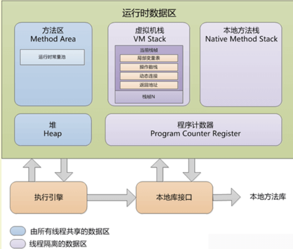
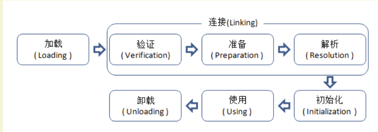

# Java虚拟机

### JVM 由哪些部分组成？

- 程序计数器

  ： Java 线程私有，类似于操作系统里的 PC 计数器，它可以看做是当前线程所执行的字节码的行号指示器。

  - 如果线程正在执行的是一个 Java 方法，这个计数器记录的是正在执行的虚拟机字节码指令的地址；如果正在执行的是 Native 方法，这个计数器值则为空（Undefined）。
  - 此内存区域是唯一一个在 Java 虚拟机规范中没有规定任何 OutOfMemoryError 情况的区域。

- 虚拟机栈（栈内存）

  ：Java线程私有，虚拟机栈描述的是 Java 方法执行的内存模型：

  - 每个方法在执行的时候，都会创建一个栈帧用于存储局部变量、操作数、动态链接、方法出口等信息。
  - 每个方法调用都意味着一个栈帧在虚拟机栈中入栈到出栈的过程。

- **本地方法栈** ：和 Java 虚拟机栈的作用类似，区别是该区域为 JVM 提供使用 Native 方法的服务。

- 堆内存

  （线程共享）：所有线程共享的一块区域，垃圾收集器管理的主要区域。

  - 目前主要的垃圾回收算法都是分代收集算法，所以 Java 堆中还可以细分为：新生代和老年代；再细致一点的有 Eden 空间、From Survivor 空间、To Survivor 空间等，默认情况下新生代按照 `8:1:1` 的比例来分配。
  - 根据 Java 虚拟机规范的规定，Java 堆可以处于物理上不连续的内存空间中，只要逻辑上是连续的即可，就像我们的磁盘一样。

- 方法区

  （线程共享）：各个线程共享的一个区域，用于存储虚拟机加载的类信息、常量、静态变量、即时编译器编译后的代码等数据。

  - 虽然 Java 虚拟机规范把方法区描述为堆的一个逻辑部分，但是它却有一个别名叫做 Non-Heap（非堆），目的应该是与 Java 堆区分开来。
  - 运行时常量池：是方法区的一部分，用于存放编译器生成的各种字面量和符号引用。

### 类加载器是如何加载 Class 文件的

- 第一个阶段，加载(Loading)，是找到 `.class` 文件并把这个文件包含的字节码加载到内存中。
- 第二阶段，连接(Linking)，又可以分为三个步骤，分别是字节码验证、Class 类数据结构分析及相应的内存分配、最后的符号表的解析。
- 第三阶段，Initialization(类中静态属性和初始化赋值)，以及Using(静态块的执行)等

#### **1）加载**

在加载阶段，虚拟机需要完成以下三件事情：

- 通过一个类的全限定名来获取其定义的二进制字节流。
- 将这个字节流所代表的静态存储结构转化为方法区的运行时数据结构。
- 在Java堆中生成一个代表这个类的 `java.lang.Class` 对象，作为对方法区中这些数据的访问入口。

相对于类加载的其他阶段而言，加载阶段（准确地说，是加载阶段获取类的二进制字节流的动作）是可控性最强的阶段，因为开发人员既可以使用系统提供的类加载器来完成加载，也可以自定义自己的类加载器来完成加载。

加载阶段完成后，虚拟机外部的二进制字节流就按照虚拟机所需的格式存储在方法区之中，而且在Java堆中也创建一个 `java.lang.Class` 类的对象，这样便可以通过该对象访问方法区中的这些数据。

#### **2）连接**

**2.1 验证：确保被加载的类的正确性**

验证是连接阶段的第一步，这一阶段的目的是为了确保 Class 文件的字节流中包含的信息符合当前虚拟机的要求，并且不会危害虚拟机自身的安全。

验证阶段大致会完成4个阶段的检验动作：

- 文件格式验证：验证字节流是否符合 Class 文件格式的规范。例如：是否以 `0xCAFEBABE` 开头、主次版本号是否在当前虚拟机的处理范围之内、常量池中的常量是否有不被支持的类型。
- 元数据验证：对字节码描述的信息进行语义分析（注意：对比 javac 编译阶段的语义分析），以保证其描述的信息符合 Java 语言规范的要求。例如：这个类是否有父类，除了 `java.lang.Object` 之外。
- 字节码验证：通过数据流和控制流分析，确定程序语义是合法的、符合逻辑的。
- 符号引用验证：确保解析动作能正确执行。

**2.2 准备：为类的静态变量分配内存，并将其初始化为默认值**

准备阶段，是正式为类变量分配内存并设置类变量初始值的阶段，这些内存都将在方法区中分配。对于该阶段有以下几点需要注意：

- 1、这时候进行内存分配的仅包括类变量(`static`)，而不包括实例变量，实例变量会在对象实例化时随着对象一块分配在 Java 堆中。

- 2、这里所设置的初始值通常情况下是数据类型默认的零值(如 `0`、`0L`、`null`、`false` 等），而不是被在 Java 代码中被显式地赋予的值

假设一个类变量的定义为： `public static int value = 3`。那么静态变量 `value` 在准备阶段过后的初始值为 `0`，而不是 `3`。因为这时候尚未开始执行任何 Java 方法，而把 `value` 赋值为 `3` 的 `public static` 指令是在程序编译后，存放于**类构造器** `()` 方法之中的，所以把 `value` 赋值为 `3` 的动作将在初始化阶段才会执行

如果类字段的字段属性表中存在 ConstantValue 属性，即同时被 `final` 和 `static` 修饰，那么在准备阶段变量 `value` 就会被初始化为 ConstValue 属性所指定的值

**2.3 解析：把类中的符号引用转换为直接引用**

解析阶段，是虚拟机将常量池内的符号引用替换为直接引用的过程。解析动作，主要针对类或接口、字段、类方法、接口方法、方法类型、方法句柄和调用点限定符 7 类符号引用进行。

- 符号引用，就是一组符号来描述目标，可以是任何字面量。
- 直接引用，就是直接指向目标的指针、相对偏移量或一个间接定位到目标的句柄。

**3）初始化**

初始化，为类的静态变量赋予正确的初始值，JVM 负责对类进行初始化，主要对类变量进行初始化。在 Java 中对类变量进行初始值设定有两种方式：

- 1、声明类变量是指定初始值。
- 2、使用静态代码块为类变量指定初始值。

JVM 初始化步骤：

- 1、假如这个类还没有被加载和连接，则程序先加载并连接该类。
- 2、假如该类的直接父类还没有被初始化，则先初始化其直接父类。
- 3、假如类中有初始化语句，则系统依次执行这些初始化语句。