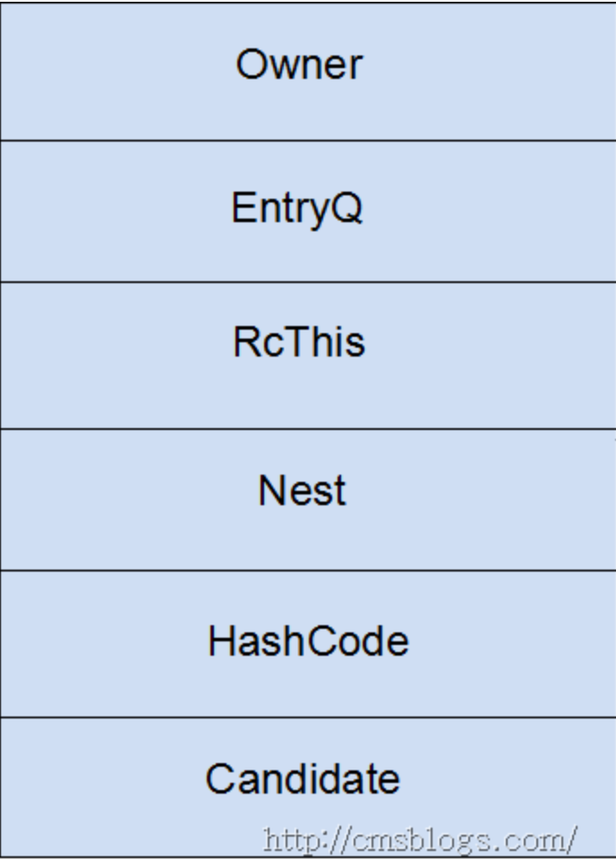
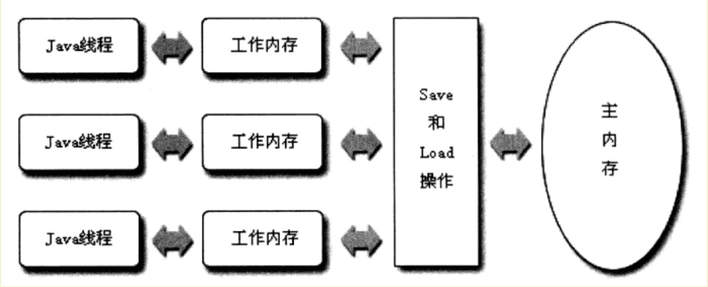

# Java并发

### Java锁

#### synchronized实现原理

1. 普通同步方法，锁是当前实例对象
2. 静态同步方法，锁是当前类的 class 对象
3. 同步方法块，锁是括号里面的对象

**同步代码块**：`monitorenter` 指令插入到同步代码块的开始位置，`monitorexit` 指令插入到同步代码块的结束位置，JVM 需要保证每一个 `monitorenter` 都有一个 `monitorexit` 与之相对应。任何对象都有一个 Monitor 与之相关联，当且一个 Monitor 被持有之后，他将处于锁定状态。线程执行到 `monitorenter` 指令时，将会尝试获取对象所对应的 Monitor 所有权，即尝试获取对象的锁。

**同步方法**：`synchronized` 方法则会被翻译成普通的方法调用和返回指令如：`invokevirtual`、`areturn` 指令，在 VM 字节码层面并没有任何特别的指令来实现被`synchronized` 修饰的方法，而是在 Class 文件的方法表中将该方法的 `access_flags` 字段中的 `synchronized` 标志位置设置为 1，表示该方法是同步方法，并使用**调用该方法的对象**或**该方法所属的 Class 在 JVM 的内部对象表示 Klass** 作为锁对象

#### Java 对象头、Monitor

Hotspot 虚拟机的对象头主要包括两部分数据：Mark Word（标记字段）、Klass Pointer（类型指针）

- Klass Point 是是对象指向它的类元数据的指针，虚拟机通过这个指针来确定这个对象是哪个类的实例。
- Mark Word 用于存储对象自身的运行时数据，它是实现轻量级锁和偏向锁的关键，所以下面将重点阐述 Mark Word


对象头信息是与对象自身定义的数据无关的额外存储成本，但是考虑到虚拟机的空间效率，Mark Word 被设计成一个**非固定**的数据结构以便在极小的空间内存存储尽量多的数据，它会根据对象的状态复用自己的存储空间，也就是说，Mark Word 会随着程序的运行发生变化，变化状态如下


#### Monitor

- **互斥**： 一个 Monitor 锁在同一时刻只能被一个线程占用，其他线程无法占用。
- **信号机制( signal )**： 占用 Monitor 锁失败的线程会暂时放弃竞争并等待某个谓词成真（条件变量），但该条件成立后，当前线程会通过释放锁通知正在等待这个条件变量的其他线程，让其可以重新竞争锁。

Monitor Record 是线程**私有**的数据结构，每一个线程都有一个可用 Monitor Record 列表，同时还有一个全局的可用列表。
每一个被锁住的对象都会和一个 Monitor Record 关联（对象头的 MarkWord 中的 LockWord 指向 Monitor 的起始地址），Monitor Record 中有一个 Owner 字段，存放拥有该锁的线程的唯一标识，表示该锁被这个线程占用。其结构如下：



- **Owner**：1）初始时为 NULL 表示当前没有任何线程拥有该 Monitor Record；2）当线程成功拥有该锁后保存线程唯一标识；3）当锁被释放时又设置为 NULL 。
- **EntryQ**：关联一个系统互斥锁（ semaphore ），阻塞所有试图锁住 Monitor Record失败的线程 。
- **RcThis**：表示 blocked 或 waiting 在该 Monitor Record 上的所有线程的个数。
- **Nest**：用来实现重入锁的计数。
- **HashCode**：保存从对象头拷贝过来的 HashCode 值（可能还包含 GC age ）。
- **Candidate**：用来避免不必要的阻塞或等待线程唤醒。因为每一次只有一个线程能够成功拥有锁，如果每次前一个释放锁的线程唤醒所有正在阻塞或等待的线程，会引起不必要的上下文切换（从阻塞到就绪然后因为竞争锁失败又被阻塞）从而导致性能严重下降。Candidate 只有两种可能的值 ：1）0 表示没有需要唤醒的线程；2）1 表示要唤醒一个继任线程来竞争锁

#### 锁优化

简单来说，在 JVM 中 `monitorenter` 和 `monitorexit` 字节码依赖于底层的操作系统的Mutex Lock 来实现的，但是由于使用 Mutex Lock 需要将当前线程挂起并从用户态切换到内核态来执行，这种切换的代价是非常昂贵的。然而，在现实中的大部分情况下，同步方法是运行在单线程环境（**无锁竞争环境**），如果每次都调用 Mutex Lock 那么将严重的影响程序的性能

#### 自旋锁

线程的阻塞和唤醒，**需要 CPU 从用户态转为核心态**。频繁的阻塞和唤醒对 CPU 来说是一件负担很重的工作，势必会给系统的并发性能带来很大的压力。同时，我们发现在许多应用上面，**对象锁的锁状态只会持续很短一段时间**。为了这一段很短的时间，频繁地阻塞和唤醒线程是非常不值得的。所以引入自旋锁。

#### 锁消除

为了保证数据的完整性，我们在进行操作时需要对这部分操作进行同步控制。但是，在有些情况下，JVM检测到不可能存在共享数据竞争，这是JVM会对这些同步锁进行锁消除。如果不存在竞争，为什么还需要加锁呢？所以锁消除可以节省毫无意义的请求锁的时间。

#### 锁粗化

锁粗话概念比较好理解，就是将**多个连续的加锁、解锁操作连接在一起，扩展成一个范围更大的锁**。

#### 锁升级

##### 重量级锁

重量级锁通过对象内部的监视器（Monitor）实现。

##### 轻量级锁

引入轻量级锁的主要目的，是在没有多线程竞争的前提下，减少传统的重量级锁使用操作系统互斥量产生的性能消耗。

当关闭偏向锁功能或者多个线程竞争偏向锁，导致**偏向锁升级为轻量级锁**，则会尝试获取轻量级锁，其步骤如下：

**获取锁**

1. 判断当前对象是否处于无锁状态？**若是**，则 JVM 首先将在当前线程的栈帧中，建立一个名为锁记录（Lock Record）的空间，用于存储锁对象目前的 Mark Word的 拷贝（官方把这份拷贝加了一个 Displaced 前缀，即 Displaced Mark Word）；**否则**，执行步骤（3）；
2. JVM 利用 CAS 操作尝试将对象的 Mark Word 更新为指向 Lock Record 的指正。如果**成功**，表示竞争到锁，则将锁标志位变成 `00`（表示此对象处于轻量级锁状态），执行同步操作；如果**失败**，则执行步骤（3）；
3. 判断当前对象的 Mark Word 是否指向当前线程的栈帧？如果**是**，则表示当前线程已经持有当前对象的锁，则直接执行同步代码块；**否则**，只能说明该锁对象已经被其他线程抢占了，当前线程便尝试使用**自旋**来获取锁。若自旋后没有获得锁，此时轻量级锁会升级为重量级锁，锁标志位变成 `10`，当前线程会被阻塞


### volatile 实现原理

#### **`volatile` 有什么用**

`volatile` 保证内存可见性和禁止指令重排。

#### **`volatile` 数组和引用类型**

如果改变引用指向的数组，将会受到 `volatile` 的保护。

只能保证这个引用的可见性，不能保证其内部的属性。

#### **`volatile` 和 `synchronized` 的区别**

1. `volatile` 本质是在告诉 JVM 当前变量在寄存器（工作内存）中的值是不确定的，需要从主存中读取。`synchronized` 则是锁定当前变量，只有当前线程可以访问该变量，其他线程被阻塞住。
2. `volatile` 仅能使用在变量级别。`synchronized` 则可以使用在变量、方法、和类级别的。
3. `volatile` 仅能实现变量的修改可见性，不能保证原子性。而`synchronized` 则可以保证变量的修改可见性和原子性。
4. `volatile` 不会造成线程的阻塞。`synchronized` 可能会造成线程的阻塞。
5. `volatile` 标记的变量不会被编译器优化。`synchronized`标记的变量可以被编译器优化


####  **什么场景下可以使用 `volatile` 替换 `synchronized`**

1 写 N 读

### Java内存模型

Java 内存模型规定了所有的变量都存储在主内存（Main Memory）中。每条线程还有自己的工作内存（Working Memory），线程的工作内存中保存了被该线程使用到的变量的主内存副本拷贝，线程对变量的所有操作（读取、赋值等）都必须在**工作内存**中进行，而不能直接读写主内存中的变量。不同的线程之间也无法直接访问对方工作内存中的变量，线程间的变量值的传递均需要通过主内存来完成，线程、主内存、工作内存三者的关系如下图：



#### 为什么代码会重排序？

在执行程序时，为了提供性能，处理器和编译器常常会对指令进行重排序，但是不能随意重排序，不是你想怎么排序就怎么排序，它需要满足以下两个条件：

- 在单线程环境下不能改变程序运行的结果。
- 存在数据依赖关系的不允许重排序

举例

```java

在线程A中:

context = loadContext();

inited = true;

 

在线程B中:

while(!inited ){ //根据线程A中对inited变量的修改决定是否使用context变量

   sleep(100);

}

doSomethingwithconfig(context);

 

假设线程A中发生了指令重排序:

inited = true;

context = loadContext();

 

那么B中很可能就会拿到一个尚未初始化或尚未初始化完成的context,从而引发程序错误。
```


#### 什么是内存屏障？

对主存的一次访问一般花费硬件的数百次时钟周期。处理器通过缓存（caching）能够从数量级上降低内存延迟的成本这些缓存为了性能重新排列待定内存操作的顺序。也就是说，程序的读写操作不一定会按照它要求处理器的顺序执行。当数据是不可变的，同时/或者数据限制在线程范围内，这些优化是无害的。如果把这些优化与对称多处理（symmetric multi-processing）和共享可变状态（shared mutable state）结合，那么就是一场噩梦。

当基于共享可变状态的内存操作被重新排序时，程序可能行为不定。一个线程写入的数据可能被其他线程可见，原因是数据写入的顺序不一致。适当的放置内存屏障，通过强制处理器顺序执行待定的内存操作来避免这个问题