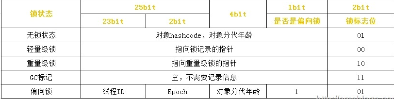

# Java并发

### Java锁

#### synchronized实现原理

1. 普通同步方法，锁是当前实例对象
2. 静态同步方法，锁是当前类的 class 对象
3. 同步方法块，锁是括号里面的对象

**同步代码块**：`monitorenter` 指令插入到同步代码块的开始位置，`monitorexit` 指令插入到同步代码块的结束位置，JVM 需要保证每一个 `monitorenter` 都有一个 `monitorexit` 与之相对应。任何对象都有一个 Monitor 与之相关联，当且一个 Monitor 被持有之后，他将处于锁定状态。线程执行到 `monitorenter` 指令时，将会尝试获取对象所对应的 Monitor 所有权，即尝试获取对象的锁。

**同步方法**：`synchronized` 方法则会被翻译成普通的方法调用和返回指令如：`invokevirtual`、`areturn` 指令，在 VM 字节码层面并没有任何特别的指令来实现被`synchronized` 修饰的方法，而是在 Class 文件的方法表中将该方法的 `access_flags` 字段中的 `synchronized` 标志位置设置为 1，表示该方法是同步方法，并使用**调用该方法的对象**或**该方法所属的 Class 在 JVM 的内部对象表示 Klass** 作为锁对象

#### Java 对象头、Monitor

Hotspot 虚拟机的对象头主要包括两部分数据：Mark Word（标记字段）、Klass Pointer（类型指针）

- Klass Point 是是对象指向它的类元数据的指针，虚拟机通过这个指针来确定这个对象是哪个类的实例。
- Mark Word 用于存储对象自身的运行时数据，它是实现轻量级锁和偏向锁的关键，所以下面将重点阐述 Mark Word

对象头信息是与对象自身定义的数据无关的额外存储成本，但是考虑到虚拟机的空间效率，Mark Word 被设计成一个**非固定**的数据结构以便在极小的空间内存存储尽量多的数据，它会根据对象的状态复用自己的存储空间，也就是说，Mark Word 会随着程序的运行发生变化，变化状态如下

#### volatile 实现原理

#### **`volatile` 有什么用**

`volatile` 保证内存可见性和禁止指令重排。

#### **`volatile` 数组和引用类型**

如果改变引用指向的数组，将会受到 `volatile` 的保护。

只能保证这个引用的可见性，不能保证其内部的属性。

#### **`volatile` 和 `synchronized` 的区别**

1. `volatile` 本质是在告诉 JVM 当前变量在寄存器（工作内存）中的值是不确定的，需要从主存中读取。`synchronized` 则是锁定当前变量，只有当前线程可以访问该变量，其他线程被阻塞住。
2. `volatile` 仅能使用在变量级别。`synchronized` 则可以使用在变量、方法、和类级别的。
3. `volatile` 仅能实现变量的修改可见性，不能保证原子性。而`synchronized` 则可以保证变量的修改可见性和原子性。
4. `volatile` 不会造成线程的阻塞。`synchronized` 可能会造成线程的阻塞。
5. `volatile` 标记的变量不会被编译器优化。`synchronized`标记的变量可以被编译器优化

####  **什么场景下可以使用 `volatile` 替换 `synchronized`**

1 写 N 读

### Java内存模型

Java 内存模型规定了所有的变量都存储在主内存（Main Memory）中。每条线程还有自己的工作内存（Working Memory），线程的工作内存中保存了被该线程使用到的变量的主内存副本拷贝，线程对变量的所有操作（读取、赋值等）都必须在**工作内存**中进行，而不能直接读写主内存中的变量。不同的线程之间也无法直接访问对方工作内存中的变量，线程间的变量值的传递均需要通过主内存来完成，线程、主内存、工作内存三者的关系如下图：

#### 为什么代码会重排序？

在执行程序时，为了提供性能，处理器和编译器常常会对指令进行重排序，但是不能随意重排序，不是你想怎么排序就怎么排序，它需要满足以下两个条件：

- 在单线程环境下不能改变程序运行的结果。
- 存在数据依赖关系的不允许重排序

#### 什么是内存屏障？

对主存的一次访问一般花费硬件的数百次时钟周期。处理器通过缓存（caching）能够从数量级上降低内存延迟的成本这些缓存为了性能重新排列待定内存操作的顺序。也就是说，程序的读写操作不一定会按照它要求处理器的顺序执行。当数据是不可变的，同时/或者数据限制在线程范围内，这些优化是无害的。如果把这些优化与对称多处理（symmetric multi-processing）和共享可变状态（shared mutable state）结合，那么就是一场噩梦。

当基于共享可变状态的内存操作被重新排序时，程序可能行为不定。一个线程写入的数据可能被其他线程可见，原因是数据写入的顺序不一致。适当的放置内存屏障，通过强制处理器顺序执行待定的内存操作来避免这个问题