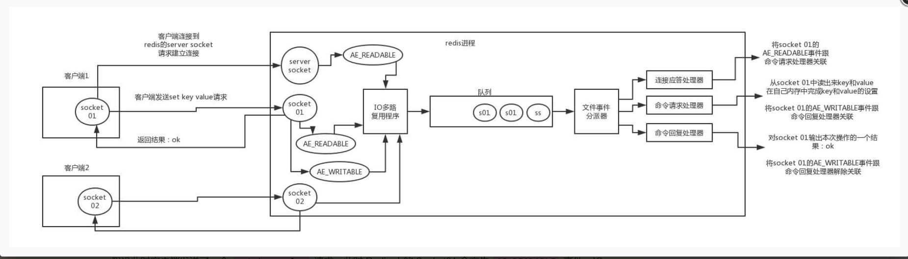

# Redis

### Redis 的线程模型

Redis 内部使用文件事件处理器 `file event handler`，这个文件事件处理器是单线程的，所以 Redis 才叫做单线程的模型。它采用 IO 多路复用机制同时监听多个 Socket，根据 Socket 上的事件来选择对应的事件处理器进行处理。

文件事件处理器的结构包含 4 个部分：

- 多个 Socket 。
- IO 多路复用程序。
- 文件事件分派器。
- 事件处理器（连接应答处理器、命令处理器、命令回复处理器）。



- 客户端 Socket01 向 Redis 的 Server Socket 请求建立连接，此时 Server Socket 会产生一个 `AE_READABLE` 事件，IO 多路复用程序监听到 server socket 产生的事件后，将该事件压入队列中。文件事件分派器从队列中获取该事件，交给`连接应答处理器`。连接应答处理器会创建一个能与客户端通信的 Socket01，并将该 Socket01 的 `AE_READABLE` 事件与命令请求处理器关联。
- 假设此时客户端发送了一个 `set key value` 请求，此时 Redis 中的 Socket01 会产生 `AE_READABLE` 事件，IO 多路复用程序将事件压入队列，此时事件分派器从队列中获取到该事件，由于前面 Socket01 的 `AE_READABLE` 事件已经与命令请求处理器关联，因此事件分派器将事件交给命令请求处理器来处理。命令请求处理器读取 Scket01 的 `set key value` 并在自己内存中完成 `set key value` 的设置。操作完成后，它会将 Scket01 的 `AE_WRITABLE` 事件与令回复处理器关联。
- 如果此时客户端准备好接收返回结果了，那么 Redis 中的 Socket01 会产生一个 `AE_WRITABLE` 事件，同样压入队列中，事件分派器找到相关联的命令回复处理器，由命令回复处理器对 socket01 输入本次操作的一个结果，比如 `ok`，之后解除 Socket01 的 `AE_WRITABLE` 事件与命令回复处理器的关联


### Redis效率高的原因

1、C 语言实现。

2、纯内存操作。

3、基于非阻塞的 IO 多路复用机制。

4、单线程，避免了多线程的频繁上下文切换问题。

5、丰富的数据结构。


### Redis持久化方式

- 1、【全量】RDB 持久化，是指在指定的时间间隔内将内存中的**数据集快照**写入磁盘。实际操作过程是，fork 一个子进程，先将数据集写入临时文件，写入成功后，再替换之前的文件，用二进制压缩存储。
- 2、【增量】AOF持久化，以日志的形式记录服务器所处理的每一个**写、删除操作**，查询操作不会记录，以文本的方式记录，可以打开文件看到详细的操作记录。

####  **RDB 优缺点**

##### 优点

- 灵活设置备份频率和周期。你可能打算每个小时归档一次最近 24 小时的数据，同时还要每天归档一次最近 30 天的数据。通过这样的备份策略，一旦系统出现灾难性故障，我们可以非常容易的进行恢复。
- 非常适合冷备份，对于灾难恢复而言，RDB 是非常不错的选择。因为我们可以非常轻松的将一个单独的文件压缩后再转移到其它存储介质上。推荐，可以将这种完整的数据文件发送到一些远程的安全存储上去，比如说 Amazon 的 S3 云服务上去，在国内可以是阿里云的 OSS 分布式存储上。
- 性能最大化。对于 Redis 的服务进程而言，在开始持久化时，它唯一需要做的只是 fork 出子进程，之后再由子进程完成这些持久化的工作，这样就可以极大的避免服务进程执行 IO 操作了。也就是说，RDB 对 Redis 对外提供的读写服务，影响非常小，可以让 Redis 保持高性能。
- 恢复更快。相比于 AOF 机制，RDB 的恢复速度更更快，更适合恢复数据，特别是在数据集非常大的情况

##### 缺点

- 如果你想保证数据的高可用性，即最大限度的避免数据丢失，那么 RDB 将不是一个很好的选择。因为系统一旦在定时持久化之前出现宕机现象，此前没有来得及写入磁盘的数据都将丢失。

- 由于 RDB 是通过 fork 子进程来协助完成数据持久化工作的，因此，如果当数据集较大时，可能会导致整个服务器停止服务几百毫秒，甚至是 1 秒钟。

#### **AOF 优缺点**

##### 优点

- 该机制可以带来更高的**数据安全性**，即数据持久性。Redis 中提供了 3 种同步策略，即每秒同步、每修改(执行一个命令)同步和不同步。

  - 事实上，每秒同步也是异步完成的，其效率也是非常高的，所差的是一旦系统出现宕机现象，那么这一秒钟之内修改的数据将会丢失。
  - 而每修改同步，我们可以将其视为同步持久化，即每次发生的数据变化都会被立即记录到磁盘中。可以预见，这种方式在效率上是最低的。
  - 至于不同步，无需多言，我想大家都能正确的理解它。

- 由于该机制对日志文件的写入操作采用的是 **append** 模式，因此在写入过程中即使出现宕机现象，也不会破坏日志文件中已经存在的内容。

  - 因为以 append-only 模式写入，所以没有任何磁盘寻址的开销，写入性能非常高。
  - 另外，如果我们本次操作只是写入了一半数据就出现了系统崩溃问题，不用担心，在 Redis 下一次启动之前，我们可以通过 redis-check-aof 工具来帮助我们解决数据一致性的问题。

- 如果 AOF 日志过大，Redis 可以自动启用 **rewrite** 机制。即使出现后台重写操作，也不会影响客户端的读写。因为在 rewrite log 的时候，会对其中的指令进行压缩，创建出一份需要恢复数据的最小日志出来。再创建新日志文件的时候，老的日志文件还是照常写入。当新的 merge 后的日志文件 ready 的时候，再交换新老日志文件即可。

  > 注意，AOF **rewrite** 机制，和 RDB 一样，也需要 fork 出一次子进程，如果 Redis 内存比较大，可能会因为 fork 阻塞下主进程。

- AOF 包含一个格式清晰、易于理解的日志文件用于记录所有的**修改操作**。事实上，我们也可以通过该文件完成数据的重建。

##### 缺点

- 对于相同数量的数据集而言，AOF 文件通常要大于 RDB 文件。RDB 在恢复大数据集时的速度比 AOF 的恢复速度要快。
- 根据同步策略的不同，AOF 在运行效率上往往会慢于 RDB 。总之，每秒同步策略的效率是比较高的，同步禁用策略的效率和 RDB 一样高效。
- 以前 AOF 发生过 bug ，就是通过 AOF 记录的日志，进行数据恢复的时候，没有恢复一模一样的数据出来。所以说，类似 AOF 这种较为复杂的基于命令日志/merge/回放的方式，比基于 RDB 每次持久化一份完整的数据快照文件的方式，更加脆弱一些，容易有 bug 。不过 AOF 就是为了避免 rewrite 过程导致的 bug ，因此每次 rewrite 并不是基于旧的指令日志进行 merge 的，而是基于当时内存中的数据进行指令的重新构建，这样健壮性会好很多。

#### **如何选择**

- 不要仅仅使用 RDB，因为那样会导致你丢失很多数据。
- 也不要仅仅使用 AOF，因为那样有两个问题，第一，你通过 AOF 做冷备，没有 RDB 做冷备，来的恢复速度更快; 第二，RDB 每次简单粗暴生成数据快照，更加健壮，可以避免 AOF 这种复杂的备份和恢复机制的 bug 。
- Redis 支持同时开启开启两种持久化方式，我们可以综合使用 AOF 和 RDB 两种持久化机制，用 AOF 来保证数据不丢失，作为数据恢复的第一选择; 用 RDB 来做不同程度的冷备，在 AOF 文件都丢失或损坏不可用的时候，还可以使用 RDB 来进行快速的数据恢复。
  - 如果同时使用 RDB 和 AOF 两种持久化机制，那么在 Redis 重启的时候，会使用 **AOF** 来重新构建数据，因为 AOF 中的**数据更加完整**。

### Redis数据淘汰策略

1. volatile-lru

   从已设置过期时间的数据集中挑选最近最少使用的数据淘汰。redis并不是保证取得所有数据集中最近最少使用的键值对，而只是随机挑选的几个键值对中的， 当内存达到限制的时候无法写入非过期时间的数据集。

2. volatile-ttl

   从已设置过期时间的数据集中挑选将要过期的数据淘汰。redis 并不是保证取得所有数据集中最近将要过期的键值对，而只是随机挑选的几个键值对中的， 当内存达到限制的时候无法写入非过期时间的数据集。

3. volatile-random

   从已设置过期时间的数据集中任意选择数据淘汰。当内存达到限制的时候无法写入非过期时间的数据集。

4. allkeys-lru

   从数据集中挑选最近最少使用的数据淘汰。当内存达到限制的时候，对所有数据集挑选最近最少使用的数据淘汰，可写入新的数据集。

5. allkeys-random

   从数据集中任意选择数据淘汰，当内存达到限制的时候，对所有数据集挑选随机淘汰，可写入新的数据集。

6. 【默认策略】no-enviction

   当内存达到限制的时候，不淘汰任何数据，不可写入任何数据集，所有引起申请内存的命令会报错。


### Redis数据类型

#### String

- **缓存功能：String**字符串是最常用的数据类型，不仅仅是**Redis**，各个语言都是最基本类型，因此，利用**Redis**作为缓存，配合其它数据库作为存储层，利用**Redis**支持高并发的特点，可以大大加快系统的读写速度、以及降低后端数据库的压力。
- **计数器：**许多系统都会使用**Redis**作为系统的实时计数器，可以快速实现计数和查询的功能。而且最终的数据结果可以按照特定的时间落地到数据库或者其它存储介质当中进行永久保存。
- **共享用户Session：**用户重新刷新一次界面，可能需要访问一下数据进行重新登录，或者访问页面缓存**Cookie**，但是可以利用**Redis**将用户的**Session**集中管理，在这种模式只需要保证**Redis**的高可用，每次用户**Session**的更新和获取都可以快速完成。大大提高效率。

#### Hash

#### List

- lrange实现分页查询
- 消息队列

#### Set

分布式去重

#### SortedSet

排行榜


### 缓存

#### 缓存雪崩

缓存同时失效导致的数据库访问过多

##### 解决

失效时间加随机值

#### 缓存穿透

缓存和数据库没有数据,用户不断发起请求

##### 解决

用户校验,将查询的Key对应的Value设置为Null

##### 布隆过滤器

**原理**

布隆过滤器的原理是，当一个元素被加入集合时，通过K个散列函数将这个元素映射成一个位数组中的K个点，把它们置为1。检索时，我们只要看看这些点是不是都是1就（大约）知道集合中有没有它了：如果这些点有任何一个0，则被检元素一定不在；如果都是1，则被检元素很可能在。这就是布隆过滤器的基本思想


**缺点**

- 存在误判
- 删除困难

**BIt数组大小选择**

根据预估数据量n以及误判率fpp，bit数组大小的m的计算方式：


**哈希函数选择**

 由预估数据量n以及bit数组长度m，可以得到一个hash函数的个数k：


#### 缓存击穿

热点Key失效后导致的请求访问数据库 

##### 解决

分布式锁

热点数据永不失效


### 缓存一致性

#### 更新缓存的设计模式

##### 1.Cache Aside Pattern(旁路缓存)

- **失效**：应用程序先从cache取数据，没有得到，则从数据库中取数据，成功后，放到缓存中。

- **命中**：应用程序从cache中取数据，取到后返回。

- **更新**：先把数据存到数据库中，成功后，再让缓存失效。

##### 2.Read/Write Through Pattern

在上面的Cache Aside套路中，我们的应用代码需要维护两个数据存储，**一个是缓存（Cache），一个是数据库（Repository）。**所以，应用程序比较啰嗦。而Read/Write Through套路是把更新数据库（Repository）的操作由缓存自己代理了，所以，对于应用层来说，就简单很多了。**可以理解为，应用认为后端就是一个单一的存储，而存储自己维护自己的Cache。**

Read Through 套路就是**在查询操作中更新缓存**，也就是说，当缓存失效的时候（过期或LRU换出），Cache Aside是由调用方负责把数据加载入缓存，而Read Through则用缓存服务自己来加载，从而对应用方是透明的。

Write Through 套路和Read Through相仿，**不过是在更新数据时发生。当有数据更新的时候，如果没有命中缓存，直接更新数据库，然后返回。如果命中了缓存，则更新缓存，然后再由Cache自己更新数据库（这是一个同步操作）**


##### 3.Write Behind Caching Pattern

Write Back套路，一句说就是，在更新数据的时候，只更新缓存，不更新数据库，而我们的缓存会异步地批量更新数据库。

Write Back实现逻辑比较复杂，因为他需要track有哪数据是被更新了的，需要刷到持久层上。操作系统的write back会在仅当这个cache需要失效的时候，才会被真正持久起来，比如，内存不够了，或是进程退出了等情况，这又叫lazy write

#### 缓存结构设计

##### 1.更新缓存 VS 淘汰缓存

更新缓存：数据不但写入数据库，还会写入缓存；优点：缓存不会增加一次miss，命中率高

淘汰缓存：数据只会写入数据库，不会写入缓存，只会把数据淘汰掉；优点：简单

##### 2.先操作数据库 vs 先操作缓存

对于一个不能保证事务性的操作，一定涉及“哪个任务先做，哪个任务后做”的问题，解决这个问题的方向是：**如果出现不一致，谁先做对业务的影响较小，就谁先执行。**


假设先写数据库，再淘汰缓存：第一步写数据库操作成功，第二步淘汰缓存失败，则会出现DB中是新数据，Cache中是旧数据，数据不一致。


假设先淘汰缓存，再写数据库：第一步淘汰缓存成功，第二步写数据库失败，则只会引发一次Cache miss。

#### 缓存和DB一致性的解决方案

##### 先淘汰缓存，再写数据库

多线程情况下可能在线程A写数据库时,线程B拿到旧数据写入缓存

我们需要解决缓存并行写，实现串行写。比较简单的方式，引入分布式锁。

- 在写请求时，先淘汰缓存之前，获取该分布式锁。
- 在读请求时，发现缓存不存在时，先获取分布式锁。

这样，缓存的并行写就成功的变成串行写落。写请求时，是否主动更新缓存，根据自己业务的需要，是否有，都没问题。

##### 先写数据库,再淘汰缓存

- 缓存删除失败,写入消息队列,异步处理
- 数据库写入BinLog更新,异步发送消息,处理缓存

##### 缓存双淘汰+设置缓存过期时间

删除缓存---更新数据库---删除缓存

如果第一次删除缓存和更新数据库中存在多线程问题,导致缓存数据库不一致,通过第二次删除缓存解决,如果第二次删除缓存失败通过过期时间删除缓存,出现需要过期时间的概率极低

### Redis主从

#### 复制

当从节点启动后，会向主数据库发送SYNC命令。同时主数据库收到SYNC命令后会开始在后台保存快照（即RDB持久化，在主从复制时，会无条件触发RDB），并将保存快照期间接收到的命令缓存起来，当快照完成后，redis会将快照文件和所有缓存命令发送给数据库。从数据库接收到快照文件和缓存命令后，会载入快照文件和执行命令，也就是说redis是通过RDB持久化文件和redis缓存命令来时间主从复制。一般在建立主从关系时，一次同步会进行复制初始化

复制初始化结束后，主数据库每当受到写命令时，就会将命令同步给从数据库，保证主从数据一致性

#### 哨兵模式

- 集群监控：负责监控 Redis master 和 slave 进程是否正常工作。
- 消息通知：如果某个 **Redis** 实例有故障，那么哨兵负责发送消息作为报警通知给管理员。
- 故障转移：如果 master node 挂掉了，会自动转移到 slave node 上。
- 配置中心：如果故障转移发生了，通知 client 客户端新的 master 地址。

#### **为什么至少需要3个Sentinel实例**

当指定时间内指定哨兵数量都认为主节点宕机则称为客观宕机。那指定数量是多少呢？这个指定数量实际上等于哨兵数量 / 2 + 1.也就是说如果哨兵数量等于2，出现一个哨兵宕机的情况，在需要主从切换的时候因为无法达到认为主节点宕机的哨兵数量为2，所以在主节点出现宕机时无法进行主从切换。所以说部署哨兵至少需要3个Sentinel实例来保证健壮性

#### **节点的两种宕机状态**

哨兵检测到主节点宕机一般有两种状态：sdown(主观宕机)和odown(客观宕机)。如果只有一个哨兵认为这个主节点宕机了，则成为主观宕机。如果达到一定数量的节点认为该主节点宕机，则成为客观宕机。

#### Redis集群

将所有数据按Key值进行CRC16计算再对槽数16384取余则能得到分配的槽中,通过将槽映射到Redis集群中实现负载均衡

##### CRC校验


### Redis分布式锁

#### Redis单机实现

setnx+lua

set key value px milliseconds nx保证过期时间和设置Key这两个操作的原子性

lua脚本保证确保数据的创建者是本机和删除Key的原子性


```java
- 获取锁（unique_value可以是UUID等）
SET resource_name unique_value NX PX 30000

- 释放锁（lua脚本中，一定要比较value，防止误解锁）
if redis.call("get",KEYS[1]) == ARGV[1] then
    return redis.call("del",KEYS[1])
else
    return 0
end
```

##### 缺点

加锁时只作用在一个Redis节点上，即使Redis通过sentinel保证高可用，如果这个master节点由于某些原因发生了主从切换，那么就会出现锁丢失的情况：

1. 在Redis的master节点上拿到了锁；
2. 但是这个加锁的key还没有同步到slave节点；
3. master故障，发生故障转移，slave节点升级为master节点；
4. 导致锁丢失。

#### RedLock算法

在Redis的分布式环境中，我们假设有N个Redis master。这些节点**完全互相独立，不存在主从复制或者其他集群协调机制**。我们确保将在N个实例上使用与在Redis单实例下相同方法获取和释放锁。现在我们假设有5个Redis master节点，同时我们需要在5台服务器上面运行这些Redis实例，这样保证他们不会同时都宕掉。

为了取到锁，客户端应该执行以下操作:

- 获取当前Unix时间，以毫秒为单位。
- 依次尝试从5个实例，使用相同的key和**具有唯一性的value**（例如UUID）获取锁。当向Redis请求获取锁时，客户端应该设置一个网络连接和响应超时时间，这个超时时间应该小于锁的失效时间。例如你的锁自动失效时间为10秒，则超时时间应该在5-50毫秒之间。这样可以避免服务器端Redis已经挂掉的情况下，客户端还在死死地等待响应结果。如果服务器端没有在规定时间内响应，客户端应该尽快尝试去另外一个Redis实例请求获取锁。
- 客户端使用当前时间减去开始获取锁时间（步骤1记录的时间）就得到获取锁使用的时间。**当且仅当从大多数**（N/2+1，这里是3个节点）**的Redis节点都取到锁，并且使用的时间小于锁失效时间时，锁才算获取成功**。
- 如果取到了锁，key的真正有效时间等于有效时间减去获取锁所使用的时间（步骤3计算的结果）。
- 如果因为某些原因，获取锁失败（没有在至少N/2+1个Redis实例取到锁或者取锁时间已经超过了有效时间），客户端应该在**所有的Redis实例上进行解锁**（即便某些Redis实例根本就没有加锁成功，防止某些节点获取到锁但是客户端没有得到响应而导致接下来的一段时间不能被重新获取锁）。