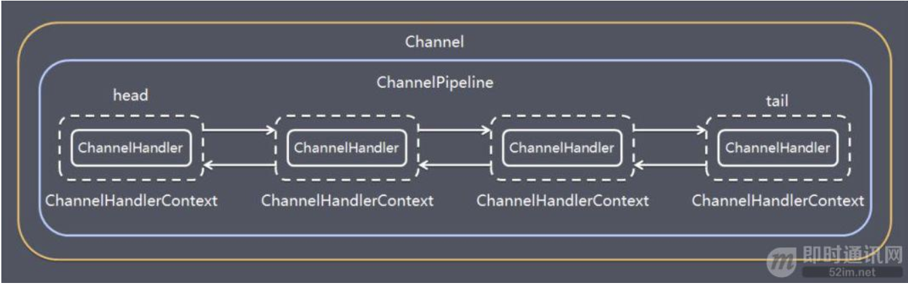

# 项目问题

## RPC

### 项目流程

##### 客户端启动

1.客户端启动

2.读取properties文件

3.注册invoker到zk

4.为已上线服务端注册对应channel

5.生成代理对象

##### 服务端启动

1.读取properties文件

2.将provider注册到zk

启动Netty端口

##### 客户端调用方法

1.拿到provider信息根据负载均衡选择服务端口

2.包装request

3.向线程池里生成任务

4.线程池拿到对应channel并完成远程调用

##### 服务端接受请求

根据id拿到对应的Bean,完成实例操作,将结果封装并返回

##### Netty

客户端 接受服务端返回的repsonse后将结果封装在Map中,Key为标识符,value为BlockingQueue

### Netty原理

NIO

NIO 可以在 Channel 进行读写操作。这些 Channel 都会被注册在 Selector 多路复用器上。Selector 通过一个线程不停的轮询这些 Channel 。找出已经准备就绪的 Channel 执行 IO 操作

##### 缓冲区 Buffer 

它是 NIO 与 BIO 的一个重要区别

- BIO 是将数据直接写入或读取到流 Stream 对象中。
- NIO 的数据操作都是在 Buffer 中进行的。Buffer 实际上是一个数组。Buffer 最常见的类型是ByteBuffer，另外还有 CharBuffer，ShortBuffer，IntBuffer，LongBuffer，FloatBuffer，DoubleBuffer

##### 通道 Channel 

和流 Stream 不同，通道是双向的。NIO可以通过 Channel 进行数据的读、写和同时读写操作。

- 通道分为两大类：一类是网络读写（SelectableChannel），一类是用于文件操作（FileChannel）。我们使用的是前者 SocketChannel 和 ServerSocketChannel ，都是SelectableChannel 的子类。

##### 多路复用器 Selector 

NIO 编程的基础。多路复用器提供选择已经就绪的任务的能力：就是 Selector 会不断地轮询注册在其上的通道（Channel），如果某个通道处于就绪状态，会被 Selector 轮询出来，然后通过 SelectionKey 可以取得就绪的Channel集合，从而进行后续的 IO 操作

##### BIO、NIO 有什么区别？

- BIO：一个连接一个线程，客户端有连接请求时服务器端就需要启动一个线程进行处理。所以，线程开销大。可改良为用线程池的方式代替新创建线程，被称为伪异步 IO 。
- NIO：一个请求一个线程，但客户端发送的连接请求都会注册到多路复用器上，多路复用器轮询到连接有新的 I/O 请求时，才启动一个线程进行处理。可改良为一个线程处理多个请求，基于多 Reactor 模型。

##### 单 Reactor 单线程模型

##### 单 Reactor 多线程模型

##### 多Reactor多线程模型

##### Netty架构

Server 端包含 1 个 Boss NioEventLoopGroup 和 1 个 Worker NioEventLoopGroup。

NioEventLoopGroup 相当于 1 个事件循环组，这个组里包含多个事件循环 NioEventLoop，每个 NioEventLoop 包含 1 个 Selector 和 1 个事件循环线程。

每个 Boss NioEventLoop 循环执行的任务包含 3 步：

1）轮询 Accept 事件；

2）处理 Accept I/O 事件，与 Client 建立连接，生成 NioSocketChannel，并将 NioSocketChannel 注册到某个 Worker NioEventLoop 的 Selector 上；

3）处理任务队列中的任务，runAllTasks。任务队列中的任务包括用户调用 eventloop.execute 或 schedule 执行的任务，或者其他线程提交到该 eventloop 的任务。

每个 Worker NioEventLoop 循环执行的任务包含 3 步：

1）轮询 Read、Write 事件；

2）处理 I/O 事件，即 Read、Write 事件，在 NioSocketChannel 可读、可写事件发生时进行处理；

3）处理任务队列中的任务，runAllTasks。

##### ChannelPipeline

在 Netty 中每个 Channel 都有且仅有一个 ChannelPipeline 与之对应，它们的组成关系如下：

一个 Channel 包含了一个 ChannelPipeline，而 ChannelPipeline 中又维护了一个由 ChannelHandlerContext 组成的双向链表，并且每个 ChannelHandlerContext 中又关联着一个 ChannelHandler。

## SpringIOC AOP

#### AOP

切面：拦截器类，其中会定义切点以及通知

切点：具体拦截的某个业务点。

通知：切面当中的方法，声明通知方法在目标业务层的执行位置，通知类型如下：

1. 前置通知：@Before 在目标业务方法执行之前执行
2. 后置通知：@After 在目标业务方法执行之后执行
3. 返回通知：@AfterReturning 在目标业务方法返回结果之后执行
4. 异常通知：@AfterThrowing 在目标业务方法抛出异常之后
5. 环绕通知：@Around 功能强大，可代替以上四种通知，还可以控制目标业务方法是否执行以及何时执行

#### IOC

**控制反转，具体来说即为将对对象的创建交给第三方来控制，我们只需要将Bean的信息告诉第三方即可**

## 