# 操作系统

## 基本功能概述

### 1. 进程管理

进程控制、进程同步、进程通信、死锁处理、处理机调度等。

### 2. 内存管理

内存分配、地址映射、内存保护与共享、虚拟内存等。

### 3. 文件管理

文件存储空间的管理、目录管理、文件读写管理和保护等。

### 4. 设备管理

完成用户的 I/O 请求，方便用户使用各种设备，并提高设备的利用率。

主要包括缓冲管理、设备分配、设备处理、虛拟设备等。

### 中断分类

#### 1.外中断

由 CPU 执行指令以外的事件引起，如 I/O 完成中断，表示设备输入/输出处理已经完成，处理器能够发送下一个输入/输出请求。此外还有时钟中断、控制台中断等。

#### 2.异常

由 CPU 执行指令的内部事件引起，如非法操作码、地址越界、算术溢出等。

#### 3.系统调用

在用户程序中使用系统调用。

##### 3.1什么是系统调用

一个进程在用户态需要使用内核态的功能,进行系统调用进入内核态,由操作系统代完成

##### 3.2用户态

用户态运行的进程或可以直接读取用户程序的数据

##### 3.3内核态

可以简单的理解系统态运行的进程或程序几乎可以访问计算机的任何资源，不受限制

## 进程与线程

### 1.进程

进程是资源分配的基本单位

进程控制块 (Process Control Block, PCB) 描述进程的基本信息和运行状态，所谓的创建进程和撤销进程，都是指对 PCB 的操作。

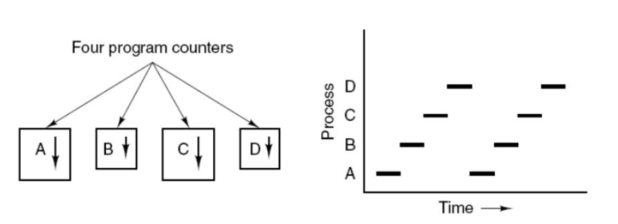

### 2.线程

线程是独立调度的基本单位

一个进程中可以有多个线程，它们共享进程资源

### 3.区别

#### 1.拥有资源

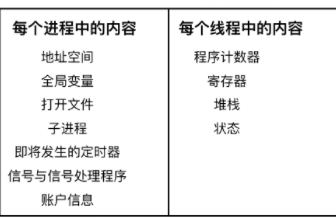

进程是资源分配的基本单位，但是线程不拥有资源，线程可以访问隶属进程的资源。

#### 2.调度

线程是独立调度的基本单位，在同一进程中，线程的切换不会引起进程切换，从一个进程中的线程切换到另一个进程中的线程时，会引起进程切换。

#### 3.系统开销

由于创建或撤销进程时，系统都要为之分配或回收资源，如内存空间、I/O 设备等，所付出的开销远大于创建或撤销线程时的开销。类似地，在进行进程切换时，涉及当前执行进程 CPU 环境的保存及新调度进程 CPU 环境的设置(PCB切换,内核栈的切换,页表的切换)，而线程切换时只需保存和设置少量寄存器内容，开销很小。

#### 4.通信方面

线程间可以通过直接读写同一进程中的数据进行通信，但是进程通信需要借助 IPC。


### 进程状态切换

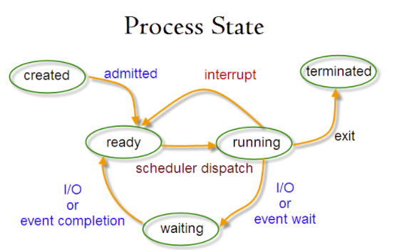

- 就绪状态（ready）：等待被调度
- 运行状态（running）
- 阻塞状态（waiting）：等待资源

- 只有就绪态和运行态可以相互转换，其它的都是单向转换。就绪状态的进程通过调度算法从而获得 CPU 时间，转为运行状态；而运行状态的进程，在分配给它的 CPU 时间片用完之后就会转为就绪状态，等待下一次调度。
- 阻塞状态是缺少需要的资源从而由运行状态转换而来，但是该资源不包括 CPU 时间，缺少 CPU 时间会从运行态转换为就绪态。

### 进程调度算法

#### 1.批处理系统

##### 先来先服务

非抢占式的调度算法，按照请求的顺序进行调度。

有利于长作业，但不利于短作业，因为短作业必须一直等待前面的长作业执行完毕才能执行，而长作业又需要执行很长时间，造成了短作业等待时间过长。

##### 短作业优先

非抢占式的调度算法，按估计运行时间最短的顺序进行调度。

长作业有可能会饿死，处于一直等待短作业执行完毕的状态。因为如果一直有短作业到来，那么长作业永远得不到调度。

##### 最短剩余时间优先

最短作业优先的抢占式版本，按剩余运行时间的顺序进行调度。 当一个新的作业到达时，其整个运行时间与当前进程的剩余时间作比较。如果新的进程需要的时间更少，则挂起当前进程，运行新的进程。否则新的进程等待。

#### 2.交互系统

##### 时间片轮转

将所有就绪进程按 FCFS 的原则排成一个队列，每次调度时，把 CPU 时间分配给队首进程，该进程可以执行一个时间片。当时间片用完时，由计时器发出时钟中断，调度程序便停止该进程的执行，并将它送往就绪队列的末尾，同时继续把 CPU 时间分配给队首的进程

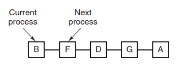

**优先级调度**

为每个进程分配一个优先级，按优先级进行调度。

为了防止低优先级的进程永远等不到调度，可以随着时间的推移增加等待进程的优先级


##### 多级反馈队列

一个进程需要执行 100 个时间片，如果采用时间片轮转调度算法，那么需要交换 100 次。

多级队列是为这种需要连续执行多个时间片的进程考虑，它设置了多个队列，每个队列时间片大小都不同，例如 1,2,4,8,..。进程在第一个队列没执行完，就会被移到下一个队列。这种方式下，之前的进程只需要交换 7 次。

每个队列优先权也不同，最上面的优先权最高。因此只有上一个队列没有进程在排队，才能调度当前队列上的进程。

可以将这种调度算法看成是时间片轮转调度算法和优先级调度算法的结合

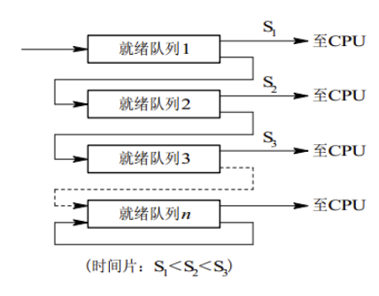

### 进程同步

#### 1.临界区

对临界资源进行访问的那段代码称为临界区。

为了互斥访问临界资源，每个进程在进入临界区之前，需要先进行检查。

#### 2.同步与互斥

- 同步：多个进程因为合作产生的直接制约关系，使得进程有一定的先后执行关系。
- 互斥：多个进程在同一时刻只有一个进程能进入临界区。

#### 3.信号量

信号量（Semaphore）是一个整型变量，可以对其执行 down 和 up 操作，也就是常见的 P 和 V 操作。

- **down** : 如果信号量大于 0 ，执行 -1 操作；如果信号量等于 0，进程睡眠，等待信号量大于 0；
- **up** ：对信号量执行 +1 操作，唤醒睡眠的进程让其完成 down 操作。

down 和 up 操作需要被设计成原语，不可分割，通常的做法是在执行这些操作的时候屏蔽中断。

如果信号量的取值只能为 0 或者 1，那么就成为了 **互斥量（Mutex）** ，0 表示临界区已经加锁，1 表示临界区解锁。

##### **使用信号量实现生产者-消费者问题**

问题描述：使用一个缓冲区来保存物品，只有缓冲区没有满，生产者才可以放入物品；只有缓冲区不为空，消费者才可以拿走物品。

因为缓冲区属于临界资源，因此需要使用一个互斥量 mutex 来控制对缓冲区的互斥访问。

为了同步生产者和消费者的行为，需要记录缓冲区中物品的数量。数量可以使用信号量来进行统计，这里需要使用两个信号量：empty 记录空缓冲区的数量，full 记录满缓冲区的数量。其中，empty 信号量是在生产者进程中使用，当 empty 不为 0 时，生产者才可以放入物品；full 信号量是在消费者进程中使用，当 full 信号量不为 0 时，消费者才可以取走物品。

注意，不能先对缓冲区进行加锁，再测试信号量。也就是说，不能先执行 down(mutex) 再执行 down(empty)。如果这么做了，那么可能会出现这种情况：生产者对缓冲区加锁后，执行 down(empty) 操作，发现 empty = 0，此时生产者睡眠。消费者不能进入临界区，因为生产者对缓冲区加锁了，消费者就无法执行 up(empty) 操作，empty 永远都为 0，导致生产者永远等待下，不会释放锁，消费者因此也会永远等待下去。


```c
#define N 100
typedef int semaphore;
semaphore mutex = 1;
semaphore empty = N;
semaphore full = 0;

void producer() {
    while(TRUE) {
        int item = produce_item();
        down(&empty);
        down(&mutex);
        insert_item(item);
        up(&mutex);
        up(&full);
    }
}

void consumer() {
    while(TRUE) {
        down(&full);
        down(&mutex);
        int item = remove_item();
        consume_item(item);
        up(&mutex);
        up(&empty);
    }
}
```

##### **哲学家进餐问题**

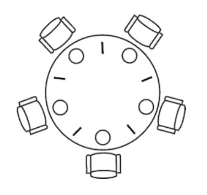

五个哲学家围着一张圆桌，每个哲学家面前放着食物。哲学家的生活有两种交替活动：吃饭以及思考。当一个哲学家吃饭时，需要先拿起自己左右两边的两根筷子，并且一次只能拿起一根筷子

**策略一**

至多只允许四个哲学家同时进餐，以保证至少有一个哲学家能够进餐，最终总会释放出他所使用过的两支筷子，从而可使更多的哲学家进餐。定义信号量count，只允许4个哲学家同时进餐，这样就能保证至少有一个哲学家可以就餐。

```c
semaphore chopstick[5]={1,1,1,1,1};
semaphore count=4; // 设置一个count，最多有四个哲学家可以进来
void philosopher(int i)
{
	while(true)
	{
		think();
		wait(count); //请求进入房间进餐 当count为0时 不能允许哲学家再进来了
		wait(chopstick[i]); //请求左手边的筷子
		wait(chopstick[(i+1)%5]); //请求右手边的筷子
		eat();
		signal(chopstick[i]); //释放左手边的筷子
		signal(chopstick[(i+1)%5]); //释放右手边的筷子
		signal(count); //离开饭桌释放信号量
	}
}
```

**策略二：**

仅当哲学家的左右两支筷子都可用时，才允许他拿起筷子进餐。可以利用AND 型信号量机制实现，也可以利用信号量的保护机制实现。利用信号量的保护机制实现的思想是通过记录型信号量mutex对取左侧和右侧筷子的操作进行保护，使之成为一个原子操作，这样可以防止死锁的出现。描述如下

```c
semaphore mutex = 1; // 这个过程需要判断两根筷子是否可用，并保护起来
semaphore chopstick[5]={1,1,1,1,1};
void philosopher(int i)
{
	while(true)
	{
		/* 这个过程中可能只能由一个人在吃饭，效率低下，有五只筷子，其实是可以达到两个人同时吃饭 */
		think();
		wait(mutex); // 保护信号量
		wait(chopstick[(i+1)%5]); // 请求右手边的筷子
		wait(chopstick[i]); // 请求左手边的筷子
		signal(mutex); // 释放保护信号量
		eat();
		signal(chopstick[(i+1)%5]); // 释放右手边的筷子
		signal(chopstick[i]); // 释放左手边的筷子
	}
}
```

**策略三:**

规定奇数号的哲学家先拿起他左边的筷子，然后再去拿他右边的筷子；而偶数号的哲学家则先拿起他右边的筷子，然后再去拿他左边的筷子。按此规定，将是1、2号哲学家竞争1号筷子，3、4号哲学家竞争3号筷子。即五个哲学家都竞争奇数号筷子，获得后，再去竞争偶数号筷子，最后总会有一个哲学家能获得两支筷子而进餐


```c
void philosopher(int i)
{
	while(true)
	{
		think();
		if(i%2 == 0) //偶数哲学家，先右后左。
		{
			wait (chopstick[(i + 1)%5]) ;
			wait (chopstick[i]) ;
			eat();
			signal (chopstick[(i + 1)%5]) ;
			signal (chopstick[i]) ;
		}
		else //奇数哲学家，先左后右。
		{
			wait (chopstick[i]) ;
			wait (chopstick[(i + 1)%5]) ;
			eat();
			signal (chopstick[i]) ;
			signal (chopstick[(i + 1)%5]) ;
		}
	}
}
```

##### 读者-写者问题

允许多个进程同时对数据进行读操作，但是不允许读和写以及写和写操作同时发生。

一个整型变量 count 记录在对数据进行读操作的进程数量，一个互斥量 count_mutex 用于对 count 加锁，一个互斥量 data_mutex 用于对读写的数据加锁。

```c
typedef int semaphore;
semaphore count_mutex = 1;
semaphore data_mutex = 1;
int count = 0;

void reader() {
    while(TRUE) {
        //所有对count进行的操作都加锁,保证只有一个读者进行操作
        down(&count_mutex);
        count++;
        if(count == 1) down(&data_mutex); // 第一个读者需要对数据进行加锁，防止写进程访问
        up(&count_mutex);
        read();
        down(&count_mutex);
        count--;
        if(count == 0) up(&data_mutex);
        up(&count_mutex);
    }
}

void writer() {
    while(TRUE) {
        down(&data_mutex);
        write();
        up(&data_mutex);
    }
}
```

### 进程通信

#### 1.管道

管道是通过调用 pipe 函数创建的，fd[0] 用于读，fd[1] 用于写。

```
#include <unistd.h>
int pipe(int fd[2]);
```

```c

#include<stdio.h>
#include<unistd.h>
 
int main()
{
	int fd[2];  // 两个文件描述符
	pid_t pid;
	char buff[20];
 
	if(pipe(fd) < 0)  // 创建管道
		printf("Create Pipe Error!\n");
 
	if((pid = fork()) < 0)  // 创建子进程
		printf("Fork Error!\n");
	else if(pid > 0)  // 父进程
	{
		close(fd[0]); // 关闭读端
		write(fd[1], "hello world\n", 12);
	}
	else
	{
		close(fd[1]); // 关闭写端
		read(fd[0], buff, 20);
		printf("%s", buff);
	}
 
	return 0;

```


它具有以下限制：

- 只支持半双工通信（单向交替传输）；

- 只能在父子进程或者兄弟进程中使用。

  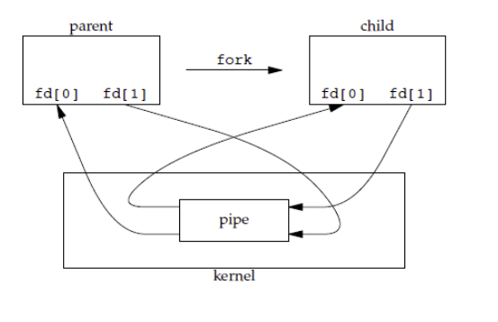

#### 2.FIFO

也称为命名管道，去除了管道只能在父子进程中使用的限制。**本质是在磁盘中生成一个文件**

```c
#include <sys/stat.h>
int  mknod(const  char*  path, mode_t mod,  dev_t dev);
int  mkfifo(const  char* path,  mode_t  mod);
```


```c
#include<stdio.h>
#include<stdlib.h>   // exit
#include<fcntl.h>    // O_WRONLY
#include<sys/stat.h>
#include<time.h>     // time
 
int main()
{
	int fd;
	int n, i;
	char buf[1024];
	time_t tp;
 
	printf("I am %d process.\n", getpid()); // 说明进程ID
	
	if((fd = open("fifo1", O_WRONLY)) < 0) // 以写打开一个FIFO 
	{
		perror("Open FIFO Failed");
		exit(1);
	}
 
	for(i=0; i<10; ++i)
	{
		time(&tp);  // 取系统当前时间
		n=sprintf(buf,"Process %d's time is %s",getpid(),ctime(&tp));
		printf("Send message: %s", buf); // 打印
		if(write(fd, buf, n+1) < 0)  // 写入到FIFO中
		{
			perror("Write FIFO Failed");
			close(fd);
			exit(1);
		}
		sleep(1);  // 休眠1秒
	}
 
	close(fd);  // 关闭FIFO文件
	return 0;
}
```

```c
read_fifo.c

#include<stdio.h>
#include<stdlib.h>
#include<errno.h>
#include<fcntl.h>
#include<sys/stat.h>
 
int main()
{
	int fd;
	int len;
	char buf[1024];
 
	if(mkfifo("fifo1", 0666) < 0 && errno!=EEXIST) // 创建FIFO管道
		perror("Create FIFO Failed");
 
	if((fd = open("fifo1", O_RDONLY)) < 0)  // 以读打开FIFO
	{
		perror("Open FIFO Failed");
		exit(1);
	}
	
	while((len = read(fd, buf, 1024)) > 0) // 读取FIFO管道
		printf("Read message: %s", buf);
 
	close(fd);  // 关闭FIFO文件
	return 0;
}
```

#### 3.消息队列


- 消息队列可以独立于读写进程存在，从而避免了 FIFO 中同步管道的打开和关闭时可能产生的困难；
- 避免了 FIFO 的同步阻塞问题，不需要进程自己提供同步方法；
- 读进程可以根据消息类型有选择地接收消息，而不像 FIFO 那样只能默认地接收。

消息队列提供了一种从一个进程向另一个进程发送一个数据块的方法。  每个数据块都被认为含有一个类型，接收进程可以独立地接收含有不同类型的数据结构。我们可以通过发送消息来避免命名管道的同步和阻塞问题。但是消息队列与命名管道一样，每个数据块都有一个最大长度的限制。

##### 1.msgget函数

```c

#include <sys/types.h>
#include <sys/ipc.h>
#include <sys/msg.h>
int msgget(key_t, key, int msgflg);
```

参数key为消息队列的键值，通常是一个长整型，可以设置为任何整数值。该参数可以用户直接指定，也可以调用ftok函数来生成，如果直接设为IPC_RPIVATE,表示总是创建新的消息队列。

参数msgflg用来建立消息队列并设定存取权限，例如IPC_CREAT|0666，它表示创建一个当前用户，用户组以及其他用户有读写权限的消息队列。如果加上IPC_EXCL,则表示只有在指定的消息队列不存在时，才会创建新的消息队列。函数执行成功后，返回消息队列的标识符，否则返回-1.

##### 2.ftok函数

```c

#include <sys/types.h>
#include <sys/ipc.h>
key_t ftok(const char *pathname,int proj_id);
```

参数pathname用来指定进程有存取权限的一个路径。

参数proj_id用来指定某个特定字符。函数执行成功后，返回一个消息队列的键值，否则返回-1.


##### **3.msgctl函数**

```c
#include <sys/types.h>
#include <sys/ipc.h>
#include <sys/msg.h>
int msgctl(int msgid, int command, struct msgid_ds *buf);
```

参数msqid为消息队列的标识符；

参数cmd为所要进行的操作，包括以下三种：

IPC_STAT ：获取消息队列的状态，返回的信息将会存储在buf指向的msqid_ds结构中。

IPC_SET  ：设置消息队列的属性，要设置的属性存储在buf指向的msqid_ds结构中。

IPC_RMID:  删除消息队列，同时清除队列中的所有消息。


msqid_ds结构的定义如下：

该函数用来对消息队列进行各种操作，例如修改消息队列的属性，清除队列中的所有消息等。

```cpp
struct msqid_ds
 
{
    
    struct ipc_perm msg_perm;            //存取权限
    
    struct msg *msg_first;               //消息队列头指针
    
    struct msg *msg_last;                //消息队列尾指针
    
    __kernel_time_t msg_stime;           //最后一次插入消息队列消息的时间
    
    __kernel_time_t msg_rtime;           //最后一次接收消息即删除队列中一个消息的时间
    
    __kernel_time_t msg_ctime;           //最后一次修改的时间
    
    struct wait_queue *wwait;            //发送消息等待进程队列
    
    struct wait_queue *rwait;
    
    unsigned short msg_cbytes;           //当前队列的字节数
    
    unsigned short msg_qnum;             //消息队列中的消息个数
    
    unsigned short msg_qbytes;           //队列的最大字节数
    
    __kernel_ipc_pid_t msg_lspid;         //最后一次消息发送进程的pid
    
    __kernel_ipc_pid_t msg_lrpid;         //最后一次消息发送进程的pid
    
};

```

##### 4.msgsnd函数

```c
#include <sys/types.h>
#include <sys/ipc.h>
#include <sys/msg.h>
int msgsend(int msqid, struct msgbuf  *msgp, int msgsz, int msgflg);
```

参数msqid为消息队列的标识符，要写入的消息存储在参数msgp所指向的msgbuf结构中，消息的 大小由参数msgsz决定，参数msgflg用来设置消息队列没有足够空间时msgsnd函数执行的动作，例如是否等待。

msgbuf结构用来包含一个消息，其定义如下：

```c

struct msgbuf
{
    long mtype;  //消息的类型
    char mtext[];//消息的内容
};
```

##### 5.msgrcv函数

参数msqid为为消息队列的标识符，消息返回后将会存储在参数msgp指向的msgbuf结构中，该结构mtext成员的长度由参数msgsz决定，参数msgtyp为请求读取消息的类型，有如下3种情况：

（1）msgtyp=0：返回消息队列中的第一个消息。

（2）msgtyp>0:返回消息队列中该类型的第一个消息。

（3）msgtyp<0:在类型小于等于msgtyp绝对值的所有消息中，返回类型值最小的第一个消息。


##### 举个例子

发送端

```c

//实现两个进程间的消息传递，消息发送程序
#include <stdlib.h>
#include <stdio.h>
#include <string.h>
#include <unistd.h>
#include <sys/types.h>
#include <sys/ipc.h>
#include <sys/msg.h>
#define MSG_SIZE 128
struct msgbuf           //定义消息结构
{
    long mtype;         //消息类型
    char mtext[MSG_SIZE];//消息的内容
};
int main()
{
    int qid;
    key_t key;
    int ret;
    struct msgbuf buf;    //消息缓冲区
    key=ftok("/home", 'a');  //生成消息队列的键值
    if (key<0)
    {
        perror("ftok error");
        exit(1);
    }
    qid=msgget(key, IPC_CREAT|0666);  //创建一个消息队列
    if (qid<0)
    {
        perror("msgget error");
        exit(1);
    }
    while (1)
    {
        printf("input the message:");
        fgets(buf.mtext,MSG_SIZE,stdin);  //从键盘输入消息的内容
        if (strncmp(buf.mtext, "exit",4)==0)  //如果键盘输入exit，退出循环
        {
            buf.mtype=getpid();
            ret=msgsnd(qid, &buf, MSG_SIZE, 0);
            break;
        }
        buf.mtype=getpid();                //消息的类型，这里设置为当前进程的标识符
        ret=msgsnd(qid, &buf, MSG_SIZE, 0); //向消息队列中发送一个消息
        if (ret<0)
        {
            perror("msgsnd error");
            exit(1);
        }
        else
        {
            printf("send!\n");
        }
    }
    return 0;
}

```

接收端

```c
#include <stdlib.h>
#include <stdio.h>
#include <string.h>
#include <unistd.h>
#include <sys/types.h>
#include <sys/ipc.h>
#include <sys/msg.h>
#define MSG_SIZE 128
struct msgbuf           //定义消息结构
{
    long mtype;         //消息类型
    char mtext[MSG_SIZE];//消息的内容
};
int main()
{
    int qid;
    key_t key;
    int ret;
    struct msgbuf buf;
    key=ftok("/home", 'a');
    if (key<0)
    {
        printf("ftok error");
        exit(1);
    }
    qid=msgget(key,IPC_EXCL|0666);  //打开消息队列
    if (qid<0)
    {
        perror("msgget error");
        exit(1);
    }
    while (1)
    {
        memset(&buf, 0, sizeof(buf));
        ret=msgrcv(qid, &buf, MSG_SIZE, 0, 0); //读取消息队列中的一个的消息
        if (ret<0)
        {
            perror("msgrcv error");
            exit(1);
        }
        else
        {
            if (strncmp(buf.mtext, "exit",4)==0)
            {
                break;
            }
            printf("received message:\n");
            printf("type=%ld,length=%ld,text:%s\n",buf.mtype,strlen(buf.mtext)-1,buf.mtext); //输入消息
        }
    }
    
    return  0;
    
}
```


#### 4.信号量

它是一个计数器，用于为多个进程提供对共享数据对象的访问。

#### 5.共享内存

不同进程映射同一文件到物理内存中,需要自己实现同步互斥,最快的IPC

#### 6.socket

网络通信


## 死锁

#### 必要条件

- 互斥：每个资源要么已经分配给了一个进程，要么就是可用的。
- 占有和等待：已经得到了某个资源的进程可以再请求新的资源。
- 不可抢占：已经分配给一个进程的资源不能强制性地被抢占，它只能被占有它的进程显式地释放。
- 环路等待：有两个或者两个以上的进程组成一条环路，该环路中的每个进程都在等待下一个进程所占有的资源。


#### 处理方法

##### 鸵鸟策略

当什么也没发生


##### 死锁检测与死锁恢复

1.每种类型一个资源的死锁检测

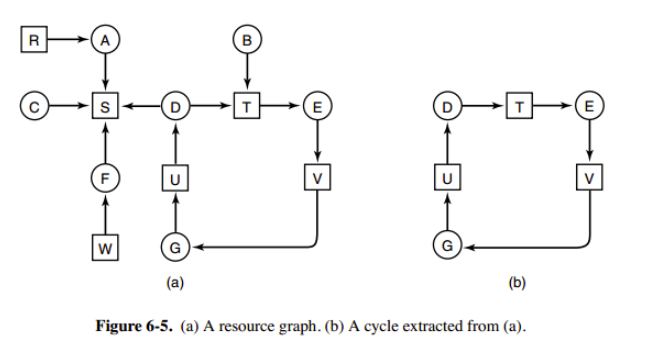

检测有向图是否存在环路


2.每种类型多个资源的死锁检测

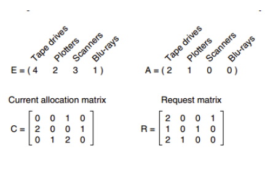

上图中，有三个进程四个资源，每个数据代表的含义如下：

- E 向量：资源总量
- A 向量：资源剩余量
- C 矩阵：每个进程所拥有的资源数量，每一行都代表一个进程拥有资源的数量
- R 矩阵：每个进程请求的资源数量

进程 P1 和 P2 所请求的资源都得不到满足，只有进程 P3 可以，让 P3 执行，之后释放 P3 拥有的资源，此时 A = (2 2 2 0)。P2 可以执行，执行后释放 P2 拥有的资源，A = (4 2 2 1) 。P1 也可以执行。所有进程都可以顺利执行，没有死锁。

算法总结如下：

每个进程最开始时都不被标记，执行过程有可能被标记。当算法结束时，任何没有被标记的进程都是死锁进程。

1. 寻找一个没有标记的进程 Pi，它所请求的资源小于等于 A。
2. 如果找到了这样一个进程，那么将 C 矩阵的第 i 行向量加到 A 中，标记该进程，并转回 1。
3. 如果没有这样一个进程，算法终止。

**找到第一个剩余资源无法满足的进程**

##### 死锁预防

破环死锁生成规则的任意一条即可

**1. 破坏互斥条件**

例如假脱机打印机技术允许若干个进程同时输出，唯一真正请求物理打印机的进程是打印机守护进程。

**2. 破坏占有和等待条件**

一种实现方式是规定所有进程在开始执行前请求所需要的全部资源。

**3. 破坏不可抢占条件**

**4. 破坏环路等待**

给资源统一编号，进程只能按编号顺序来请求资源。


##### **死锁避免**

银行家算法

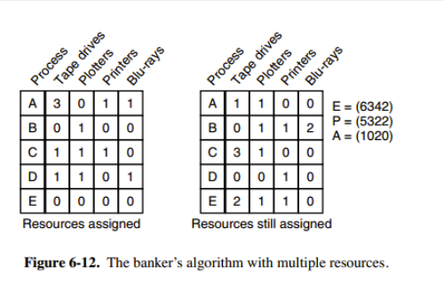

检查一个状态是否安全的算法如下：

- 查找右边的矩阵是否存在一行小于等于向量 A。如果不存在这样的行，那么系统将会发生死锁，状态是不安全的。
- 假若找到这样一行，将该进程标记为终止，并将其已分配资源加到 A 中。
- 重复以上两步，直到所有进程都标记为终止，则状态时安全的。


## 内存管理

### 虚拟内存

虚拟内存的目的是为了让物理内存扩充成更大的逻辑内存，从而让程序获得更多的可用内存。

为了更好的管理内存，操作系统将内存抽象成地址空间。每个程序拥有自己的地址空间，这个地址空间被分割成多个块，每一块称为一页。这些页被映射到物理内存，但不需要映射到连续的物理内存，也不需要所有页都必须在物理内存中。当程序引用到不在物理内存中的页时，由硬件执行必要的映射，将缺失的部分装入物理内存并重新执行失败的指令。

从上面的描述中可以看出，虚拟内存允许程序不用将地址空间中的每一页都映射到物理内存，也就是说一个程序不需要全部调入内存就可以运行，这使得有限的内存运行大程序成为可能。例如有一台计算机可以产生 16 位地址，那么一个程序的地址空间范围是 0~64K。该计算机只有 32KB 的物理内存，虚拟内存技术允许该计算机运行一个 64K 大小的程序。

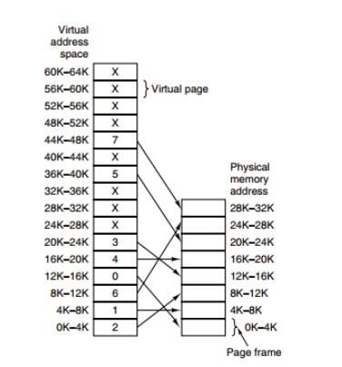

### 内存管理机制


#### **1.页式管理** 

把主存分为大小相等且固定的一页一页的形式，页较小，相对相比于块式管理的划分力度更大，提高了内存利用率，减少了碎片。页式管理通过页表对应逻辑地址和物理地址。

#### **2.段式管理** 

 页式管理虽然提高了内存利用率，但是页式管理其中的页实际并无任何实际意义。 段式管理把主存分为一段段的，每一段的空间又要比一页的空间小很多 。但是，最重要的是段是有实际意义的，每个段定义了一组逻辑信息，例如,有主程序段 MAIN、子程序段 X、数据段 D 及栈段 S 等。 段式管理通过段表对应逻辑地址和物理地址

#### **3.段页式管理**   

段页式管理机制结合了段式管理和页式管理的优点。简单来说段页式管理机制就是把主存先分成若干段，每个段又分成若干页，也就是说 **段页式管理机制** 中段与段之间以及段的内部的都是离散的,对于程序员来说看到的是分段,对于系统来说是对段进行的分页 

根据进程段表进行分段,再根据页表查询物理页位置,不存在则通过将外存中的页拉到内存中来

### 快表与多级页表

#### 快表

为了解决虚拟地址到物理地址的转换速度，操作系统在 **页表方案** 基础之上引入了 **快表** 来加速虚拟地址到物理地址的转换。我们可以把快表理解为一种特殊的高速缓冲存储器（Cache），其中的内容是页表的一部分或者全部内容。作为页表的 Cache，它的作用与页表相似，但是提高了访问速率。由于采用页表做地址转换，读写内存数据时 CPU 要访问两次主存。有了快表，有时只要访问一次高速缓冲存储器，一次主存，这样可加速查找并提高指令执行速度。

使用快表之后的地址转换流程是这样的：

1. 根据虚拟地址中的页号查快表；
2. 如果该页在快表中，直接从快表中读取相应的物理地址；
3. 如果该页不在快表中，就访问内存中的页表，再从页表中得到物理地址，同时将页表中的该映射表项添加到快表中；
4. 当快表填满后，又要登记新页时，就按照一定的淘汰策略淘汰掉快表中的一个页。

#### 多级页表

引入多级页表的主要目的是为了避免把全部页表一直放在内存中占用过多空间，特别是那些根本就不需要的页表就不需要保留在内存中,例如64位处理器 将前十位作为一级页表 中间10位二级页表,最后12位为偏移量


### 页面置换算法

#### 1.LRU 最近未使用 

#### 2.OPT页面置换算法

理想算法,预知未来使用情况

#### 3.FIFO 先进先出

#### 4.LFU 最少使用页面置换算法

### CPU cache

#### 什么是Cache

Cache是用来对内存数据的缓存。

CPU要访问的数据在Cache中有缓存，称为“命中” (Hit)，反之则称为“缺失” (Miss)。

CPU访问它的速度介于寄存器与内存之间（数量级的差别）。实现Cache的花费介于寄存器与内存之间。

CPU缓存（Cache Memory）位于CPU与内存之间的临时存储器，它的容量比内存小但交换速度快。在缓存中的数据是内存中的一小部分，但这一小部分是短时间内CPU即将访问的，当CPU调用大量数据时，就可避开内存直接从缓存中调用，从而加快读取速度。

下图是一个典型的存储器层次结构，我们可以看到一共使用了三级缓存

#### 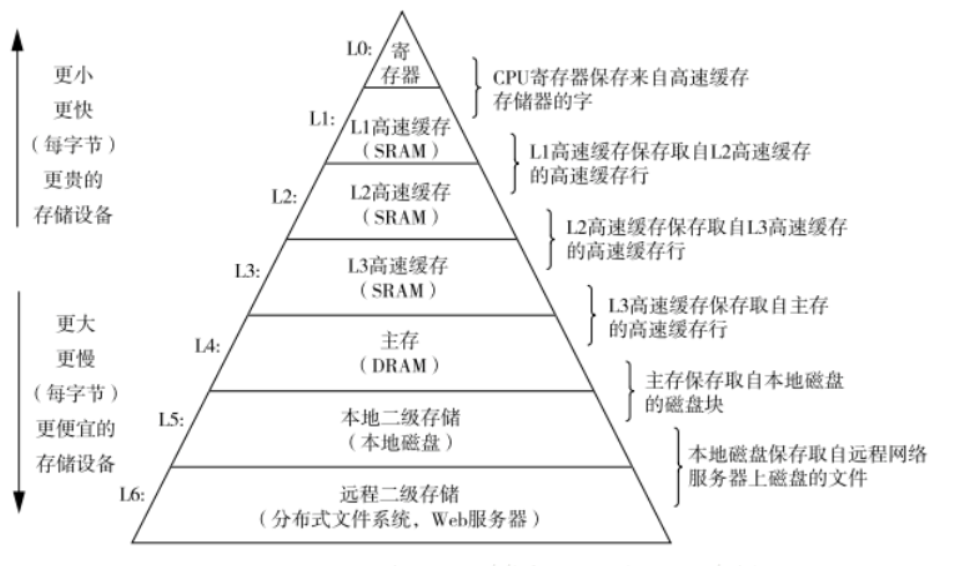为什么要有多级CPU cache

随着科技发展，热点数据的体积越来越大，单纯的增加一级缓存大小的性价比已经很低了
二级缓存就是一级缓存的缓冲器：一级缓存制造成本很高因此它的容量有限，二级缓存的作用就是存储那些CPU处理时需要用到、一级缓存又无法存储的数据。
同样道理，三级缓存和内存可以看作是二级缓存的缓冲器，它们的容量递增，但单位制造成本却递减。
另外需要注意的是，L3 Cache和L1，L2 Cache有着本质的区别。，L1和L2 Cache都是每个CPU core独立拥有一个，而L3 Cache是几个Cores共享的，可以认为是一个更小但是更快的内存。

#### cpu与cache 内存交互的过程

CPU接收到指令后，它会最先向CPU中的一级缓存（L1 Cache）去寻找相关的数据，然一级缓存是与CPU同频运行的，但是由于容量较小，所以不可能每次都命中。这时CPU会继续向下一级的二级缓存（L2 Cache）寻找，同样的道理，当所需要的数据在二级缓存中也没有的话，会继续转向L3 Cache、内存(主存)和硬盘.

程序运行时可以使用perf工具观察cache-miss的rate.

#### 什么是Cache Line

Cache Line可以简单的理解为CPU Cache中的最小缓存单位。

#### CPU缓存一致性

多个处理器对某个内存块同时读写，会引起冲突的问题，这也被称为Cache一致性问题。

### 磁盘结构

- 盘面（Platter）：一个磁盘有多个盘面；
- 磁道（Track）：盘面上的圆形带状区域，一个盘面可以有多个磁道；
- 扇区（Track Sector）：磁道上的一个弧段，一个磁道可以有多个扇区，它是最小的物理储存单位，目前主要有 512 bytes 与 4 K 两种大小；
- 磁头（Head）：与盘面非常接近，能够将盘面上的磁场转换为电信号（读），或者将电信号转换为盘面的磁场（写）；
- 制动手臂（Actuator arm）：用于在磁道之间移动磁头；
- 主轴（Spindle）：使整个盘面转动。

### 磁盘格式化

#### 1.低级格式化

划分扇区(512B) 

控制信息 1.Sector 2.ECC (纠错码)

#### 2.高级格式化

构建文件系统

#### 文件定义

文件时信息的逻辑存储单位

- 用户看来,文件时具有结构的信息集合
- 系统看来,文件的本质是存储在外存当中的二进制集合

#### 文件属性

- 文件名
- 文件类型  
  - 文本文件
  - 二进制可执行文件    
- 位置
- 大小
- 时间,日期和用户标识
- 保护

#### 文件内部结构

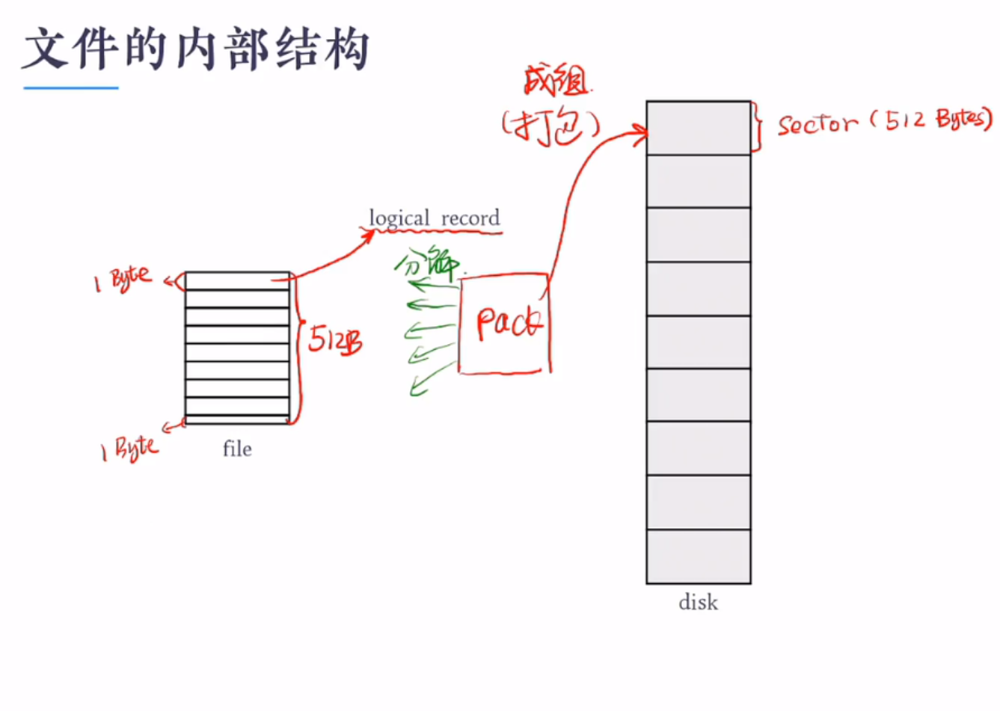

#### 访问方法

##### 顺序访问

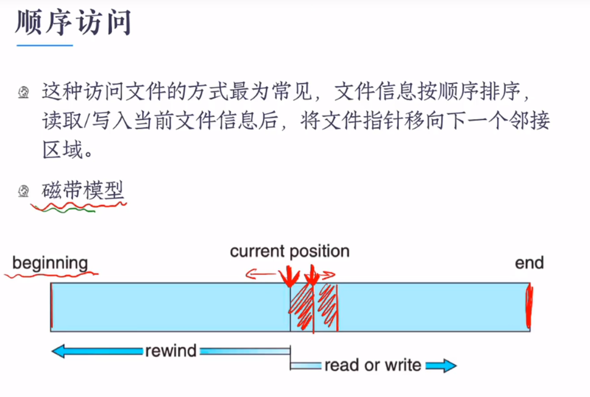

##### 直接访问

若文件的逻辑记录的长度固定,那么允许在访问文件信息时可按任意顺序进行快速读取和写入

#### 目录

  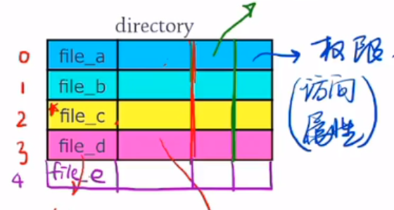 

#### Linux文件系统

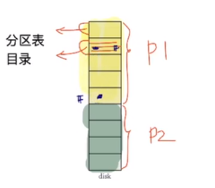


### 磁盘调度算法

读写一个磁盘块的时间的影响因素有：

- 旋转时间（主轴转动盘面，使得磁头移动到适当的扇区上）
- 寻道时间（制动手臂移动，使得磁头移动到适当的磁道上）
- 实际的数据传输时间

其中，寻道时间最长，因此磁盘调度的主要目标是使磁盘的平均寻道时间最短。


##### 1.先来先服务

##### 2.最短寻找时间

优先处理与当前磁头最近的磁道

##### 3.电梯算法

磁头只有移动到请求最外侧磁道或最内侧磁道才可以反向移动，如果在磁头移动的方向上已经没有请求，就可以立即改变磁头移动，不必移动到最内/外侧的磁道

##### 4.进阶电梯算法(循环扫描算法)

只有磁头朝某个特定方向移动时才处理磁道访问请求，而**返回时直接快速移动至最靠边缘的并且需要访问的磁道上而不处理任何请求**


### PageCache和BufferCache

**Page cache**实际上是针对文件系统的,是文件的缓存,在文件层面上的数据会缓存到page cache。文件的逻辑层需要映射到实际的物理磁盘,这种映射关系由文件系统来完成。当page cache的数据需要刷新时,page cache中的数据交给buffer cache,但是这种处理在2.6版本的内核之后就变的很简单了,没有真正意义上的cache操作

**Buffer cache**是针对磁盘块的缓存,也就是在没有文件系统的情况下,直接对磁盘进行操作的数据会缓存到buffer cache中,例如,文件系统的元数据都会缓存到buffer cache中


### RAID

#### 三大技术

##### 1.镜像

镜像是一种**冗余**技术，为磁盘提供保护功能，防止磁盘发生故障而造成数据丢失。对于 RAID 而言，采用镜像技术 典型地 将会同时在阵列中产生两个完全相同的数据副本，分布在两个不同的磁盘驱动器组上。镜像提供了完全的数据冗余能力，当一个数据副本失效不可用时，外部系统仍可正常访问**另一副本**，不会对应用系统运行和性能产生影响。而且，镜像不需要额外的计算和校验，故障修复非常快，直接复制即可。镜像技术可以从多个副本进行并发读取数据，提供更高的读 I/O 性能，但不能并行写数据，写多个副本会会导致一定的 I/O 性能降低。

　　镜像技术提供了非常高的数据安全性，其代价也是非常昂贵的，需要至少双倍的存储空间。高成本限制了镜像的广泛应用，主要应用于至关重要的数据保护，这种场合下数据丢失会造成巨大的损失。另外，镜像通过“ 拆分 ”能获得特定时间点的上数据快照，从而可以实现一种备份窗口几乎为零的数据备份技术

##### 2.数据条带

　磁盘存储的性能瓶颈在于磁头寻道定位，它是一种慢速机械运动，无法与高速的 CPU 匹配。再者，单个磁盘驱动器性能存在物理极限， I/O 性能非常有限。 RAID 由多块磁盘组成，数据条带技术将数据以块的方式分布存储在多个磁盘中，从而可以对数据进行**并发**处理。这样写入和读取数据就可以在多个磁盘上同时进行，并发产生非常高的聚合 I/O ，有效提高了整体 I/O 性能，而且具有良好的线性扩展性。这对大容量数据尤其显著，如果不分块，数据只能按顺序存储在磁盘阵列的磁盘上，需要时再按顺序读取。而通过条带技术，可获得数倍与顺序访问的性能提升。

　　数据条带技术的分块大小选择非常关键。条带粒度可以是一个字节至几 KB 大小，分块越小，并行处理能力就越强，数据存取速度就越高，但同时就会增加块存取的随机性和块寻址时间。实际应用中，要根据数据特征和需求来选择合适的分块大小，在数据存取随机性和并发处理能力之间进行平衡，以争取尽可能高的整体性能。
数据条带是基于提高 I/O 性能而提出的，也就是说它只关注性能， 而对数据可靠性、可用性没有任何改善。实际上，其中任何一个数据条带损坏都会导致整个数据不可用，采用数据条带技术反而增加了数据发生丢失的概念率

##### 3.数据校验

​		镜像具有高安全性、高读性能，但冗余开销太昂贵。数据条带通过并发性来大幅提高性能，然而对数据安全性、可靠性未作考虑。数据校验是一种冗余技术，它用校验数据来提供数据的安全，可以检测数据错误，并在能力允许的前提下进行数据重构。相对镜像，数据校验大幅缩减了冗余开销，用较小的代价换取了极佳的数据完整性和可靠性。数据条带技术提供高性能，数据校验提供数据安全性， RAID 不同等级往往同时结合使用这两种技术。

　　采用数据校验时， RAID 要在写入数据同时进行校验计算，并将得到的校验数据存储在 RAID 成员磁盘中。校验数据可以集中保存在某个磁盘或分散存储在多个不同磁盘中，甚至校验数据也可以分块，不同 RAID 等级实现各不相同。当其中一部分数据出错时，就可以对剩余数据和校验数据进行反校验计算重建丢失的数据。校验技术相对于镜像技术的优势在于节省大量开销，但由于每次数据读写都要进行大量的校验运算，对计算机的运算速度要求很高，必须使用硬件 RAID 控制器。在数据重建恢复方面，检验技术比镜像技术复杂得多且慢得多。

​		**海明校验码**和 **异或校验**是两种最为常用的 数据校验算法。海明校验码是由理查德.海明提出的，不仅能检测错误，还能给出错误位置并自动纠正。海明校验的基本思想是：将有效信息按照某种规律分成若干组，对每一个组作奇偶测试并安排一个校验位，从而能提供多位检错信息，以定位错误点并纠正。可见海明校验实质上是一种多重奇偶校验。异或校验通过异或逻辑运算产生，将一个有效信息与一个给定的初始值进行异或运算，会得到校验信息。如果有效信息出现错误，通过校验信息与初始值的异或运算能还原正确的有效信息。

#### RaID0

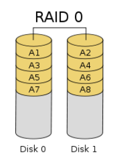

RAID0 是一种简单的、无数据校验的数据条带化技术,无校验不可靠,提升性能


#### RAID1

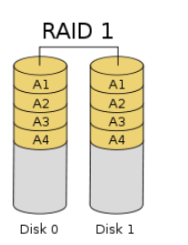

RAID1 称为镜像，它将数据完全一致地分别写到工作磁盘和镜像 磁盘，它的磁盘空间利用率为 50% 

#### **RAID2**

RAID2 称为纠错海明码磁盘阵列，其设计思想是利用海明码实现数据校验冗余,海明码是一种在原始数据中加入若干校验码来进行错误检测和纠正的编码技术

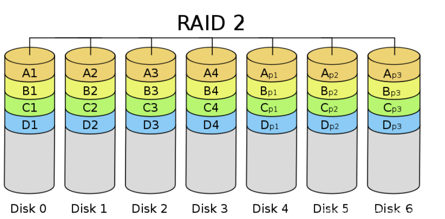


#### RAID3

RAID3 是使用专用校验盘的并行访问阵列，它采用一个专用的磁盘作为校验盘，其余磁盘作为数据盘，数据按**位可字节的方式交叉**存储到各个数据盘中。RAID3 至少需要三块磁盘，不同磁盘上同一带区的数据作 XOR 校验，校验值写入校验盘中

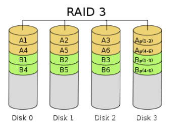

#### **RAID4**

RAID4 与 RAID3 的原理大致相同，区别在于条带化的方式不同。 RAID4 按照 **块**的方式来组织数据，写操作只涉及当前数据盘和校验盘两个盘，多个 I/O 请求可以同时得到处理，提高了系统性能。

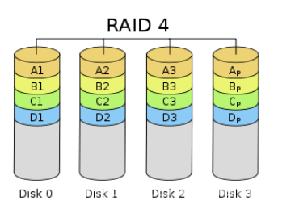

#### RAID5

 RAID5 应该是目前最常见的 RAID 等级，它的原理与 RAID4 相似，区别在于校验数据分布在阵列中的所有磁盘上，而没有采用专门的校验磁盘。对于数据和校验数据，它们的写操作可以同时发生在完全不同的磁盘上。因此， RAID5 不存在 RAID4 中的并发写操作时的校验盘性能瓶颈问题

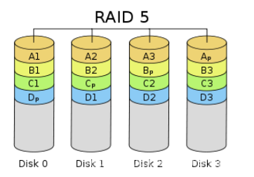

#### RAID6

前面所述的各个 RAID 等级都只能保护因单个磁盘失效而造成的数据丢失。如果两个磁盘同时发生故障，数据将无法恢复。 RAID6 引入双重校验的概念，它可以保护阵列中同时出现两个磁盘失效时，阵列仍能够继续工作，不会发生数据丢失

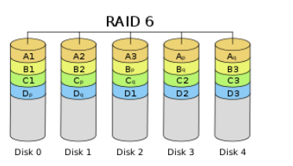

#### RAID组合

##### RAID00

简单地说， RAID00 是由多个成员 RAID0 组成的高级 RAID0 。它与 RAID0 的区别在于， RAID0 阵列替换了原先的成员磁盘。可以把 RAID00 理解为两层条带化结构的磁盘阵列，即对条带再进行条带化。这种阵列可以提供更大的存储容量、更高的 I/O 性能和更好的 I/O 负均衡

##### RAID01和RAID10

RAID01 是先做条带化再作镜像，本质是对物理磁盘实现镜像；而 RAID10 是先做镜像再作条带化，是对虚拟磁盘实现镜像

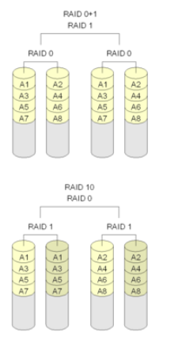

### 文件系统格式

#### Ext

全称Linux extended file system, extfs，即Linux扩展文件系统，Ext2就代表第二代文件扩展系统，Ext3/Ext4以此类推，它们都是Ext2的升级版，只不过为了快速恢复文件系统，减少一致性检查的时间，增加了日志功能，所以Ext2被称为**索引式文件系统**，而Ext3/Ext4被称为**日志式文件系统**


#### inode

记录文件的权限、属性和数据所在块`block`的号码，每个文件都有且仅有一个的`inode`，每个`inode`都有自己的编号，可以把`inode`简单地理解为**文档索引**

#### inode table

存储文件系统的所有inode编号的表格

#### block(数据区块)

存储的文件内容，也叫数据区块(data block)，每个`block`都有自己的编号，`Ext2`支持的单位`block`容量仅为**1k、2k、4k**。