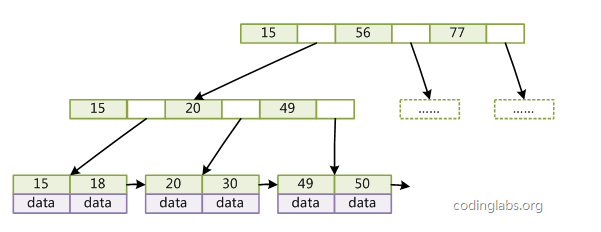

# 数据库

### 三范式

#### 第一范式

保证每列具有原子性,列不可再分

#### 第二范式

确保表中的每一列都和主键相关

#### 第三范式

数据库中的每一列和主键列直接相关而不是间接相关

### MySQL存储引擎

|              | InnoDB         | MyISAM |
| :----------- | :------------- | ------ |
| 事务         | 支持           | 不支持 |
| 存储限制     | 64TB           | 无     |
| 锁粒度       | 行锁           | 表锁   |
| 崩溃后的恢复 | 支持           | 不支持 |
| 外键         | 支持           | 不支持 |
| 全文检索     | 5.7 版本后支持 | 支持   |

### 索引

#### 索引原理

##### **B树**

首先定义一条数据记录为一个二元组[key, data]，key为记录的键值，对于不同数据记录，key是互不相同的；data为数据记录除key外的数据。那么B-Tree是满足下列条件的数据结构：

d为大于1的一个正整数，称为B-Tree的度。

h为一个正整数，称为B-Tree的高度。

每个非叶子节点由n-1个key和n个指针组成，其中d<=n<=2d。

每个叶子节点最少包含一个key和两个指针，最多包含2d-1个key和2d个指针，叶节点的指针均为null 。

所有叶节点具有相同的深度，等于树高h。

key和指针互相间隔，节点两端是指针。

一个节点中的key从左到右非递减排列。

所有节点组成树结构。

每个指针要么为null，要么指向另外一个节点。

如果某个指针在节点node最左边且不为null，则其指向节点的所有key小于v(key1)v(key1)，其中v(key1)v(key1)为node的第一个key的值。

如果某个指针在节点node最右边且不为null，则其指向节点的所有key大于v(keym)v(keym)，其中v(keym)v(keym)为node的最后一个key的值。

如果某个指针在节点node的左右相邻key分别是keyikeyi和keyi+1keyi+1且不为null，则其指向节点的所有key小于v(keyi+1)v(keyi+1)且大于v(keyi)v(keyi)。

##### B+树

每个节点的指针上限为2d而不是2d+1。

内节点不存储data，只存储key；叶子节点不存储指针

##### **带有顺序访问指针的B+Tree**

##### B树效率高的原因

根据B-Tree的定义，可知检索一次最多需要访问h个节点。数据库系统的设计者巧妙利用了磁盘预读原理，将一个节点的大小设为等于一个页，这样每个节点只需要一次I/O就可以完全载入。

##### B+树相对于B树优势

**1.B+树磁盘读写代价更低**

B+树内部结点没有Data信息,每一页装载的关键词变多,IO次数变少

**2.B+树遍历方便**

B+树底部存在顺序访问指针,可以实现整棵树的遍历

**3.B+树查询效率稳定**

由于非终结点并不是最终指向文件内容的结点，而只是叶子结点中关键字的索引。所以任何关键字的查       找必须走一条从根结点到叶子结点的路。所有关键字查询的路径长度相同，导致每一个数据的查询效率相当

#### 主键索引和非主键索引

- 主键索引的叶子节点存的数据是整行数据( 即具体数据 )。在 InnoDB 里，主键索引也被称为**聚集索引**（clustered index）。
- 非主键索引的叶子节点存的数据是整行数据的主键，键值是索引。在 InnoDB 里，非主键索引也被称为**辅助索引**（secondary index）。

#### 索引的类型

- 1、普通索引：最基本的索引，没有任何约束。
- 2、唯一索引：与普通索引类似，但具有唯一性约束。
- 3、主键索引：特殊的唯一索引，不允许有空值。
- 4、复合索引：将多个列组合在一起创建索引，可以覆盖多个列。
- 5、外键索引：只有InnoDB类型的表才可以使用外键索引，保证数据的一致性、完整性和实现级联操作。
- 6、全文索引：MySQL 自带的全文索引只能用于 InnoDB、MyISAM ，并且只能对英文进行全文检索，一般使用全文索引引擎。

#### 索引创建的原则

- 1、最适合索引的列是出现在 `WHERE` 子句中的列，或连接子句中的列，而不是出现在 `SELECT` 关键字后的列。
- 2、索引列的基数越大，索引效果越好。

- 3、根据情况创建复合索引，复合索引可以提高查询效率。

- 4、避免创建过多的索引，索引会额外占用磁盘空间，降低写操作效率。
- 5、主键尽可能选择较短的数据类型，可以有效减少索引的磁盘占用提高查询效率。
- 6、对字符串进行索引，应该定制一个前缀长度，可以节省大量的索引空间。

#### 索引使用注意事项

- 1、应尽量避免在 `WHERE` 子句中使用 `!=` 或 `<>` 操作符，否则将引擎放弃使用索引而进行全表扫描。优化器将无法通过索引来确定将要命中的行数,因此需要搜索该表的所有行

- 2、应尽量避免在 `WHERE` 子句中使用 `OR` 来连接条件，否则将导致引擎放弃使用索引而进行全表扫描，如：`SELECT id FROM t WHERE num = 10 OR num = 20` 。
- 3、应尽量避免在 `WHERE` 子句中对字段进行表达式操作，这将导致引擎放弃使用索引而进行全表扫描。
- 4、应尽量避免在 `WHERE` 子句中对字段进行函数操作，这将导致引擎放弃使用索引而进行全表扫描。
- 5、不要在 `WHERE` 子句中的 `=` 左边进行函数、算术运算或其他表达式运算，否则系统将可能无法正确使用索引。
- 6、复合索引遵循前缀原则。
- 7、如果 MySQL 评估使用索引比全表扫描更慢，会放弃使用索引。如果此时想要索引，可以在语句中添加强制索引。
- 8、列类型是字符串类型，查询时一定要给值加引号，否则索引失效。
- 9、`LIKE` 查询，`%` 不能在前，因为无法使用索引。如果需要模糊匹配，可以使用全文索引

### 事务

#### 特性

1. **原子性** Atomicity ：一个事务（transaction）中的所有操作，或者全部完成，或者全部不完成，不会结束在中间某个环节。事务在执行过程中发生错误，会被恢复（Rollback）到事务开始前的状态，就像这个事务从来没有执行过一样。即，事务不可分割、不可约简。
2. **一致性** Consistency ：在事务开始之前和事务结束以后，数据库的完整性没有被破坏。这表示写入的资料必须完全符合所有的预设约束、触发器,联回滚等。
3. **隔离性** Isolation ：数据库允许多个并发事务同时对其数据进行读写和修改的能力，隔离性可以防止多个事务并发执行时由于交叉执行而导致数据的不一致。事务隔离分为不同级别，包括读未提交（Read uncommitted）、读提交（read committed）、可重复读（repeatable read）和串行化（Serializable）。
4. **持久性** Durability ：事务处理结束后，对数据的修改就是永久的，即便系统故障也不会丢失。

#### **事务的并发问题？**

- 1、脏读：事务 A 读取了事务 B 更新的数据，然后 B 回滚操作，那么 A 读取到的数据是脏数据。

- 2、不可重复读：事务 A 多次读取同一数据，事务 B 在事务 A 多次读取的过程中，对数据作了更新并提交，导致事务 A 多次读取同一数据时，结果不一致。

- 3、幻读：系统管理员 A 将数据库中所有学生的成绩从具体分数改为 ABCDE 等级，但是系统管理员 B 就在这个时候插入了一条具体分数的记录，当系统管理员 A 改结束后发现还有一条记录没有改过来，就好像发生了幻觉一样，这就叫幻读。

  

#### 事务隔离级别

**READ UNCOMMITTED（未提交读）**：事务中的修改，即使没有提交，对其他事务也都是可见的。

**READ COMMITTED（提交读）**：事务从开始直到提交之前，所做的任何修改对其他事务都是不可见的。

**REPEATABLE READ（可重复读）**：一个事务按相同的查询条件读取以前检索过的数据，其他事务插入了满足其查询条件的新数据。产生幻行。

**SERIALIZABLE（可串行化）**：强制事务串行执行。

### MVCC

#### 什么是MVCC?

**MVCC**在**MySQL InnoDB**中的实现主要是为了提高数据库并发性能，用更好的方式去处理读-写冲突，做到即使有读写冲突时，也能做到不加锁，非阻塞并发读

#### 什么是当前读和快照读？

- **当前读**
  像select lock in share mode(`共享锁`), select for update ; update, insert ,delete(`排他锁`)这些操作都是一种当前读，为什么叫当前读？就是它读取的是记录的最新版本，读取时还要保证其他并发事务不能修改当前记录，会对读取的记录进行加锁
- **快照读**
  像`不加锁`的select操作就是快照读，即不加锁的非阻塞读；快照读的前提是隔离级别不是串行级别，串行级别下的快照读会退化成当前读；之所以出现快照读的情况，是基于提高并发性能的考虑，快照读的实现是基于多版本并发控制，即MVCC,可以认为MVCC是行锁的一个变种，但它在很多情况下，避免了加锁操作，降低了开销；既然是基于多版本，即快照读可能读到的并不一定是数据的最新版本，而有可能是之前的历史版本

#### MVCC的实现原理

MVCC的目的就是多版本并发控制，在数据库中的实现，就是为了解决`读写冲突`，它的实现原理主要是依赖记录中的 **`3个隐式字段`**，**`undo日志`** ，**`Read View`** 来实现的

#### **隐式字段**

每行记录除了我们自定义的字段外，还有数据库隐式定义的`DB_TRX_ID`,`DB_ROLL_PTR`,`DB_ROW_ID`等字段

- `DB_TRX_ID`
  6byte，最近修改(`修改/插入`)事务ID：记录创建这条记录/最后一次修改该记录的事务ID

- `DB_ROLL_PTR`
  7byte，回滚指针，指向这条记录的上一个版本（存储于rollback segment里）

- `DB_ROW_ID`
  6byte，隐含的自增ID（隐藏主键），如果数据表没有主键，InnoDB会自动以`DB_ROW_ID`产生一个聚簇索引

  

  `DB_ROW_ID`是数据库默认为该行记录生成的唯一隐式主键，`DB_TRX_ID`是当前操作该记录的事务ID,而`DB_ROLL_PTR`是一个回滚指针，用于配合undo日志，指向上一个旧版本

#### **undo日志**

- **insert undo log**
  代表事务在`insert`新记录时产生的`undo log`, 只在事务回滚时需要，并且在事务提交后可以被立即丢弃

- **update undo log**
  事务在进行`update`或`delete`时产生的`undo log`; 不仅在事务回滚时需要，在快照读时也需要；所以不能随便删除，只有在快速读或事务回滚不涉及该日志时，对应的日志才会被`purge`线程统一清除

> **purge**
>
> - 从前面的分析可以看出，为了实现InnoDB的MVCC机制，更新或者删除操作都只是设置一下老记录的deleted_bit，并不真正将过时的记录删除。
> - 为了节省磁盘空间，InnoDB有专门的purge线程来清理deleted_bit为true的记录。为了不影响MVCC的正常工作，purge线程自己也维护了一个read view（这个read view相当于系统中最老活跃事务的read view）;如果某个记录的deleted_bit为true，并且DB_TRX_ID相对于purge线程的read view可见，那么这条记录一定是可以被安全清除的。

#### Read View

**rx_ids:** 它里面的trx_ids变量存储了活跃事务列表，也就是Read View开始创建时其他未提交的活跃事务的ID列表。例如事务A在创建read view(快照)时，数据库中事务B和事务C还没提交或者回滚结束事务，此时trx_ids就会将事务B和事务C的事务ID记录下来。
**low_limit_id：** 目前出现过的最大的事务ID+1，即下一个将被分配的事务ID。
**up_limit_id：** 活跃事务列表trx_ids中最小的事务ID，如果trx_ids为空，则up_limit_id 为 low_limit_id，虽然该字段名为up_limit,但在trx_ids中的活跃事务号是降序的，所以最后一个为最小活跃事务ID。
**creator_trx_id：** 当前创建read view的事务的ID

#### MVCC查询操作实现原理

InnoDB中，事务在第一次进行普通的select查询时，会创建一个read view(快照)，用于可见性判断，事务只能查询到行记录对于事务来说可见的数据版本。可见性判断是通过行记录的DB_TRX_ID(最近一次插入/更新/删除该行记录的事务ID)以及read view中的变量比较来判断。

查询过程如下:
(1） 如果 DB_TRX_ID< up_limit_id，则表明这个行记录最近一次更新在当前事务创建快照之前就已经提交了，该记录行的值对当前事务是可见的，当前事务可以访问该行记录，跳到步骤(4)。
(2) 如果DB_TRX_ID>=low_limit_id，则表明这个行记录最近一次更新是快照创建之后才创建的事务完成的，该记录行的值对当前事务是不可见的，当前事务不可以访问该行记录。因此当前事务只能访问比该行记录更旧的数据版本。通过该记录行的 DB_ROLL_PTR 指针，找到更旧一版的行记录，取出更旧一版的行记录的事务号DB_TRX_ID，然后跳到步骤(1)重新判断当前事务是否有资格访问该行记录。
(3) 如果up_limit_id<=DB_TRX_ID< low_limit_id，则表明对这个行记录最近一次更新的事务可能是活跃列表中的事务也可能是已经成功提交的事务(事务ID号大的事务可能会比ID号小的事务先进行提交)，比如说初始时有5个事务在并发执行，事务ID分别是1001~1005，1004事务完成提交，1001事务进行普通select的时候创建的快照中活跃事务列表就是1002、1003、1005。因此up_limit_id就是1002， low_limit_id就是1006。对于这种情况，我们需要在活跃事务列表中进行遍历(因为活跃事务列表中的事务ID是有序的，因此用二分查找)，确定DB_TRX_ID是否在活跃事务列表中。
(3.1)若不在，说明对这个行记录最近一次更新的事务是在创建快照之前提交的事务，此行记录对当前事务是可见的，也就是说当前事务有资格访问此行记录，跳到步骤(4)。
(3.2)若在，说明对这个行记录最近一次更新的事务是当前活跃事务，在快照创建过程中或者之后完成的数据更新，此行记录对当前事务是不可见的(若可见则会造成脏读、不可重复读等问题)。因此当前事务只能访问该行记录的更旧的版本数据。通过该记录行的 DB_ROLL_PTR 指针，找到更旧一版的行记录，取出更旧一版的行记录的事务号DB_TRX_ID，然后跳到步骤(1)重新判断当前事务是否有资格访问该行记录。
(4)可以访问，将该行记录的值返回。

### MYSQL锁机制

#### 锁粒度

- 表锁：系统开销最小，会锁定整张表，MyIsam 使用表锁。
- 行锁：最大程度的支持并发处理，但是也带来了最大的锁开销，InnoDB 使用行锁。

#### 锁机制

##### Record lock

单条索引记录上加锁，record lock锁住的永远是索引，而非记录本身，即使该表上没有任何索引，那么innodb会在后台创建一个隐藏的聚集主键索引，那么锁住的就是这个隐藏的聚集主键索引。所以说当一条sql没有走任何索引时，那么将会在每一条聚集索引后面加X锁，这个类似于表锁，但原理上和表锁应该是完全不同的。

> SELECT * FROM tab_with_index WHERE id = 1 FOR UPDATE

##### Gap lock

在索引记录之间的间隙中加锁，或者是在某一条索引记录之前或者之后加锁，并不包括该索引记录本身。gap lock的机制主要是解决可重复读模式下的幻读问题，关于幻读的演示和gap锁如何解决了幻读。关于这一块，先给出几个定义

Innodb 的锁的策略为 next-key 锁，即 record lock + gap lock ，是通过在 index 上加 lock 实现的

- 如果 index 为 unique index ，则降级为 record lock 行锁。
- 如果是普通 index ，则为 next-key lock 。
- 如果没有 index ，则直接锁住全表，即表锁。

### MYSQL的查询执行顺序

1. from
2. join
3. on
4. where
5. groupby
6. having
7. select
8. distinct
9. order by
10. limit

#### 执行顺序简介

##### 执行FROM语句

第一步，执行FROM语句。我们首先需要知道最开始从哪个表开始的，这就是FROM告诉我们的。经过FROM语句对两个表执行笛卡尔积，会得到一个虚拟表，暂且叫VT1。总共有——table1的记录条数 * table2的记录条数——条记录，这就是VT1的结果。

##### 执行ON过滤

执行完笛卡尔积以后，接着就进行ON join_condition条件过滤，比如ON a.customer_id = b.customer_id，根据ON中指定的条件，去掉那些不符合条件的数据，得到VT2表。

##### 添加外部行（外联结）

这一步只有在连接类型为OUTER JOIN时才发生，如LEFT OUTER JOIN（左连接）、RIGHT OUTER JOIN（右连接）和FULL OUTER JOIN（经过测试Mysql不支持该连接方式）。大多数时候会省略OUTER关键字。
添加外部行的工作就是在VT2表的基础上添加保留表中被过滤条件过滤掉的数据，非保留表中的数据被赋予NULL值，最后生成虚拟表VT3。

> LEFT JOIN 关键字会从左表 (table_name1) 那里返回所有的行，即使在右表 (table_name2) 中没有匹配的行。

##### 执行WHERE过滤

对添加外部行得到的VT3进行WHERE过滤，只有符合 where_condition 的记录才会输出到虚拟表VT4中。

##### 执行GROUP BY分组

上面得到的虚拟表还没有经过聚合分组，**GROU BY子句主要是对使用WHERE子句得到的虚拟表进行分组操作。**得到的内容会存入虚拟表VT5中，此时，我们就得到了一个VT5虚拟表，接下来的操作都会在该表上完成。

##### 执行HAVING过滤

这里需要注意的是到目前为止已经有了三种过滤，ON、WHERE和HAVING，三者在执行时间段上是有严格区别的，HAVING子句主要和GROUP BY子句配合使用，对分组得到的VT5虚拟表进行条件过滤，然后得到虚拟表VT6。

##### SELECT列表

从虚拟表VT6中选择出我们需要的内容，生成虚拟表VT7。

##### 执行DISTINCT子句

如果在查询中指定了DISTINCT子句，则会创建一张内存临时表（如果内存放不下，就需要存放在硬盘了）。这张临时表的表结构和上一步产生的虚拟表VT7是一样的，不同的是对进行DISTINCT操作的列增加了一个唯一索引，以此来除重复数据。

##### 执行ORDER BY子句

对虚拟表中的内容按照指定的列进行排序，然后返回一个新的虚拟表，上述结果会存储在VT8中。

##### 执行LIMIT子句

​	

### binLog和redoLog

#### 什么是binLog

`binlog`我们可以简单理解为：存储着每条变更的`SQL`语句

#### `binlog`一般用来做什么

主要有两个作用：**复制和恢复数据**

- MySQL在公司使用的时候往往都是**一主多从**结构的，从服务器需要与主服务器的数据保持一致，这就是通过`binlog`来实现的
- 数据库的数据被干掉了，我们可以通过`binlog`来对数据进行恢复。

#### 什么是RedoLog

`redo log`的存在为了：当我们修改的时候，写完内存了，但数据还没真正写到磁盘的时候。此时我们的数据库挂了，我们可以根据`redo log`来对数据进行恢复。因为`redo log`是顺序IO，所以**写入的速度很快**，并且`redo log`记载的是物理变化（xxxx页做了xxx修改），文件的体积很小，**恢复速度很快**

write pos 是当前记录的位置，一边写一边后移，写到第 3 号文件末尾后就回到 0 号文件开头。checkpoint 是当前要擦除的位置，也是往后推移并且循环的，擦除记录前要把记录更新到数据文件。write pos 和 checkpoint 之间的是还空着的部分，可以用来记录新的操作。如果 write pos 追上 checkpoint，表示redo log满了，这时候不能再执行新的更新，得停下来先擦掉一些记录，把 checkpoint 推进一下。有了 redo log，InnoDB 就可以保证即使数据库发生异常重启，之前提交的记录都不会丢失，这个能力称为 **crash-safe**

#### BinLog和RedoLog的区别

##### 存储

`binlog`记载的是`update/delete/insert`这样的SQL语句，而`redo log`记载的是物理修改的内容（xxxx页修改了xxx）。

所以在搜索资料的时候会有这样的说法：`redo log` 记录的是数据的**物理变化**，`binlog` 记录的是数据的**逻辑变化**

##### 功能

`redo log`的作用是为**持久化**而生的。写完内存，如果数据库挂了，那我们可以通过`redo log`来恢复内存还没来得及刷到磁盘的数据，将`redo log`加载到内存里边，那内存就能恢复到挂掉之前的数据了

`binlog`的作用是复制和恢复而生的

- 主从服务器需要保持数据的一致性，通过`binlog`来同步数据。
- 如果整个数据库的数据都被删除了，`binlog`存储着所有的数据变更情况，那么可以通过`binlog`来对数据进行恢复

因为功能的不同，`redo log` 存储的是物理数据的变更，如果我们内存的数据已经刷到了磁盘了，那`redo log`的数据就无效了。所以`redo log`不会存储着**历史**所有数据的变更，**文件的内容会被覆盖的**

#### 两阶段提交

prepare：redolog写入log buffer，并fsync持久化到磁盘，在redolog事务中记录2PC的XID，在redolog事务打上prepare标识
commit：binlog写入log buffer，并fsync持久化到磁盘，在binlog事务中记录2PC的XID，同时在redolog事务打上commit标识

#### redolog和binlog二阶段提交与redolog和binlog的顺序提交是否真的有区别

如果redolog和binlog顺序提交，则具体步骤会如下：

1. redolog刷入cache并fsync刷盘，并打上commit标识
2. binlog刷入cache并fsync刷盘

类比begin…commit和begin…rollback，commit和rollback这两个操作是只能二选一，且一旦commit则不能再rollback。同样，redolog中的事务一旦打上commit标识，是无法回退的，否则有可能覆盖其他事务的更新（例如A事务对某一行进行了插入并打上commit标识，而B事务紧接着对该行进行了修改，最后A事务突然回滚B事务，则B事务的操作被强制覆盖，这是不妥的）。如果redolog进行了commit，而此时数据库crash导致binlog刷盘失败，redolog无法回滚，会造成redolog和binlog不一致。

但是通过事务可以同时提交redolog和binlog，两者落盘之后都会记录2PC事务的XID（redolog和binlog中事务落盘的标识），若中途数据库crash，通过XID关联两者并在恢复时决定commit和rollback与否，详细步骤见下一段“恢复步骤”

#### 恢复步骤

redolog中的事务如果经历了二阶段提交中的prepare阶段，则会打上prepare标识，如果经历commit阶段，则会打上commit标识（此时redolog和binlog均已落盘）。

Step1. 按顺序扫描redolog，如果redolog中的事务既有prepare标识，又有commit标识，就直接提交（复制redolog disk中的数据页到磁盘数据页）

Step2 .如果redolog事务只有prepare标识，没有commit标识，则说明当前事务在commit阶段crash了，binlog中当前事务是否完整未可知，此时拿着redolog中当前事务的XID（redolog和binlog中事务落盘的标识），去查看binlog中是否存在此XID

 a. 如果binlog中有当前事务的XID，则提交事务（复制redolog disk中的数据页到磁盘数据页）

 b. 如果binlog中没有当前事务的XID，则回滚事务（使用undolog来删除redolog中的对应事务）

### 切分

#### 水平切分

水平切分又称为 Sharding，它是将同一个表中的记录拆分到多个结构相同的表中

##### **优点：**

- 优化单一表数据量过大而产生的性能问题
- 避免IO争抢并减少锁表的几率

#### 垂直切分

垂直切分是将一张表按列切分成多个表，通常是按照列的关系密集程度进行切分，也可以利用垂直切分将经常被使用的列和不经常被使用的列切分到不同的表中

##### 优点：

1.为了避免IO争抢并减少锁表的几率，查看详情的用户与商品信息浏览互不影响

2.充分发挥热门数据的操作效率，商品信息的操作的高效率不会被商品描述的低效率所拖累

#### Sharding策略

- 哈希取模：hash(key) % N；
- 范围：可以是 ID 范围也可以是时间范围；
- 映射表：使用单独的一个数据库来存储映射关系。