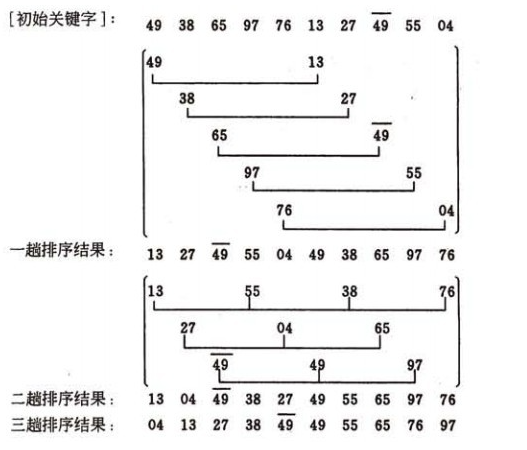

# 数据结构

### 排序

#### 1.插入排序

##### 基本思想：

将一个记录插入到已排序好的有序表中，从而得到一个新，记录数增1的有序表。即：先将序列的第1个记录看成是一个有序的子序列，然后从第2个记录逐个进行插入，直至整个序列有序为止

如果碰见一个和插入元素相等的，那么插入元素把想插入的元素放在相等元素的后面。所以，相等元素的前后顺序没有改变，从原无序序列出去的顺序就是排好序后的顺序，所以插入排序是**稳定**的

##### 时间复杂度：

O（n^2）

####  2. 插入排序—希尔排序（Shell`s Sort）

##### **基本思想:**

先将整个待排序的记录序列分割成为若干子序列分别进行直接插入排序，待整个序列中的记录“基本有序”时，再对全体记录进行依次直接插入排序。

##### 操作方法:

1. 选择一个增量序列t1，t2，…，tk，其中ti>tj，tk=1；
2. 按增量序列个数k，对序列进行k 趟排序；
3. 每趟排序，根据对应的增量ti，将待排序列分割成若干长度为m 的子序列，分别对各子表进行直接插入排序。仅增量因子为1 时，整个序列作为一个表来处理，表长度即为整个序列的长度。

**不稳定** 时间复杂度小于O（n^2）

#### **3. 选择排序—简单选择排序（Simple Selection Sort）**

##### 基本思想：

在要排序的一组数中，选出最小（或者最大）的一个数与第1个位置的数交换；然后在剩下的数当中再找最小（或者最大）的与第2个位置的数交换，依次类推，直到第n-1个元素（倒数第二个数）和第n个元素（最后一个数）比较为止。

##### 操作方法：

第一趟，从n 个记录中找出关键码最小的记录与第一个记录交换；

第二趟，从第二个记录开始的n-1 个记录中再选出关键码最小的记录与第二个记录交换；

以此类推.....

第i 趟，则从第i 个记录开始的n-i+1 个记录中选出关键码最小的记录与第i 个记录交换，

直到整个序列按关键码有序。

时间复杂度:O(N^2),稳定

#### **4. 选择排序—堆排序（Heap Sort）**

**堆顶元素**（即第一个元素）必为最小项（小顶堆）。
若以一维数组存储一个堆，则堆对应一棵完全二叉树，且所有非叶结点的值均不大于(或不小于)其子女的值，根结点（堆顶元素）的值是最小(或最大)的

整它们的存储序，使之成为一个堆，将堆顶元素输出，得到n 个元素中最小(或最大)的元素，这时堆的根节点的数最小（或者最大）。然后对前面(n-1)个元素重新调整使之成为堆，输出堆顶元素，得到n 个元素中次小(或次大)的元素。依此类推，直到只有两个节点的堆，并对它们作交换，最后得到有n个节点的有序序列。称这个过程为**堆排序**

因此，实现堆排序需解决两个问题：

1. 如何将n 个待排序的数建成堆；

2. 输出堆顶元素后，怎样调整剩余n-1 个元素，使其成为一个新堆。

首先讨论第二个问题：输出堆顶元素后，对剩余n-1元素重新建成堆的调整过程。

调整小顶堆的方法：

1）设有m 个元素的堆，输出堆顶元素后，剩下m-1 个元素。将堆底元素送入堆顶（（最后一个元素与堆顶进行交换），堆被破坏，其原因仅是根结点不满足堆的性质。

2）将根结点与左、右子树中较小元素的进行交换。

3）若与左子树交换：如果左子树堆被破坏，即左子树的根结点不满足堆的性质，则重复方法 （2）.

4）若与右子树交换，如果右子树堆被破坏，即右子树的根结点不满足堆的性质。则重复方法 （2）.

5）继续对不满足堆性质的子树进行交换操作，直到叶子结点，堆被建成。

再讨论对n 个元素初始建堆的过程。

建堆方法：对初始序列建堆的过程，就是一个反复进行筛选的过程。

对于每个结点进行遍历判断其是否小于其父结点,小于则上调

时间复杂度 O(nlogn) 不稳定

#### 5. 交换排序—冒泡排序（Bubble Sort）

##### 基本思想：

在要排序的一组数中，对当前还未排好序的范围内的全部数，自上而下对相邻的两个数依次进行比较和调整，让较大的数往下沉，较小的往上冒。即：每当两相邻的数比较后发现它们的排序与排序要求相反时，就将它们互换

时间复杂度 O(N^2),稳定

#### 6. 交换排序—快速排序（Quick Sort）

1）选择一个基准元素,通常选择第一个元素或者最后一个元素,

2）通过一趟排序讲待排序的记录分割成独立的两部分，其中一部分记录的元素值均比基准元素值小。另一部分记录的 元素值比基准值大。

3）此时基准元素在其排好序后的正确位置

4）然后分别对这两部分记录用同样的方法继续进行排序，直到整个序列有序。

（a）一趟排序的过程：

快速排序是通常被认为在同数量级（O(nlog2n)）的排序方法中平均性能最好的。但若初始序列按关键码有序或基本有序时，快排序反而蜕化为冒泡排序。为改进之，通常以“三者取中法”来选取基准记录，即将排序区间的两个端点与中点三个记录关键码居中的调整为支点记录。快速排序是一个**不稳定**的排序方法

#### 7. 归并排序（Merge Sort）

归并（Merge）排序法是将两个（或两个以上）有序表合并成一个新的有序表，即把待排序序列分为若干个子序列，每个子序列是有序的。然后再把有序子序列合并为整体有序序列。

时间复杂度O(nlogn) 不稳定

#### 8. 桶排序/基数排序(Radix Sort)

**桶排序基本思想**:

是将阵列分到有限数量的桶子里。每个桶子再个别排序（有可能再使用别的排序算法或是以递回方式继续使用桶排序进行排序）。桶排序是鸽巢排序的一种归纳结果。当要被排序的阵列内的数值是均匀分配的时候，桶排序使用线性时间（Θ（n））。但桶排序并不是 比较排序，他不受到 O(n log n) 下限的影响

**基数排序基本思想:**

是按照低位先排序，然后收集；再按照高位排序，然后再收集；依次类推，直到最高位。有时候有些属性是有优先级顺序的，先按低优先级排序，再按高优先级排序。最后的次序就是高优先级高的在前，高优先级相同的低优先级高的在前。基数排序基于分别排序，分别收集，所以是稳定的。

### 图算法

#### 最小生成树

##### **1.Kruskal算法**

此算法可以称为“加边法”，初始最小生成树边数为0，每迭代一次就选择一条满足条件的最小代价边，加入到最小生成树的边集合里。

1. 把图中的所有边按代价从小到大排序；
2. 把图中的n个顶点看成独立的n棵树组成的森林；
3. 按权值从小到大选择边，所选的边连接的两个顶点ui,viui,vi,应属于两颗不同的树，则成为最小生成树的一条边，并将这两颗树合并作为一颗树。
4. 重复(3),直到所有顶点都在一颗树内或者有n-1条边为止。

E个节点V条边,时间复杂度O(ElogV)

##### **2.Prim算法**

此算法可以称为“加点法”，每次迭代选择代价最小的边对应的点，加入到最小生成树中。算法从某一个顶点s开始，逐渐长大覆盖整个连通网的所有顶点。

1. 图的所有顶点集合为VV；初始令集合u={s},v=V−uu={s},v=V−u;
2. 在两个集合u,vu,v能够组成的边中，选择一条代价最小的边(u0,v0)(u0,v0)，加入到最小生成树中，并把v0v0并入到集合u中。
3. 重复上述步骤，直到最小生成树有n-1条边或者n个顶点为止。

由于不断向集合u中加点，所以最小代价边必须同步更新；需要建立一个辅助数组closedge,用来维护集合v中每个顶点与集合u中最小代价边信息

E个节点V条边,时间复杂度O(ElogV)

##### 