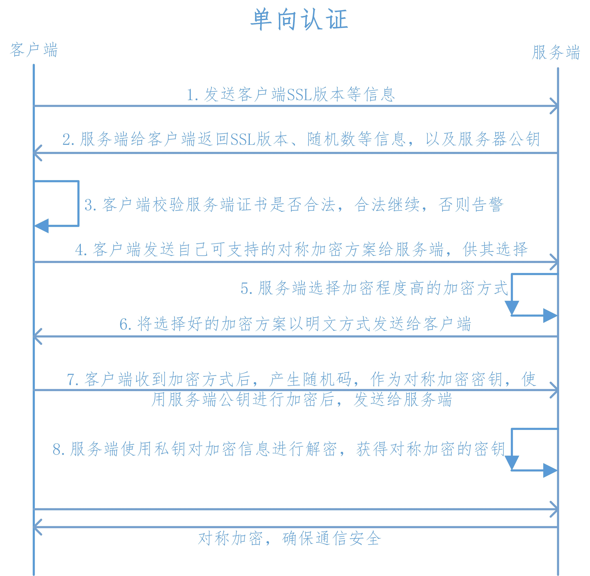

# 计算机网络

## 七层模型

### 物理层

设备之间比特流的传输，物理接口，电气特性等

### 数据链路层 

将上层数据封装成帧，用MAC地址访问媒介，错误检测与修正

##### 交换机

交换机工作于 OSI 参考模型的第二层，即数据链路层。交换机内部的 CPU 会在每个端口成功连接时，通过 ARP 协议学习它的 MAC 地址，保存成一张 ARP 表。在今后的通讯中，发往该 MAC 地址的数据包将仅送往其对应的端口，而不是所有的端口。因此，交换机可用于划分数据链路层广播，即冲突域；但它不能划分网络层广播，即广播域

##### ARP协议工作原理

网络层的 ARP 协议完成了 IP 地址与物理地址的映射。

- 首先，每台主机都会在自己的 ARP 缓冲区中建立一个 ARP 列表，以表示 IP 地址和 MAC 地址的对应关系。
- 当源主机需要将一个数据包要发送到目的主机时，会首先检查自己 ARP 列表中是否存在该 IP 地址对应的 MAC 地址：
  - 如果有，就直接将数据包发送到这个 MAC 地址。
  - 如果没有，就向本地网段发起一个ARP请求的广播包，查询此目的主机对应的 MAC 地址。此 ARP 请求数据包里包括源主机的 IP 地址、硬件地址、以及目的主机的 IP 地址。网络中所有的主机收到这个 ARP 请求后，会检查数据包中的目的 IP 是否和自己的 I P地址一致。
    - 如果不相同，就忽略此数据包。
    - 如果相同，该主机首先将发送端的 MAC 地址和 IP 地址添加到自己的 ARP 列表中(如果 ARP 表中已经存在该 IP 的信息，则将其覆盖)，然后给源主机发送一个 ARP 响应数据包，告诉对方自己是它需要查找的 MAC 地址。
      - 源主机收到这个 ARP 响应数据包后，将得到的目的主机的 IP 地址和 MAC 地址添加到自己的 ARP 列表中，并利用此信息开始数据的传输。
      - 如果源主机一直没有收到 ARP 响应数据包，表示 ARP 查询失败。

### 网络层

提供逻辑地址（IP）、选路，数据从源端到目的端的传输

##### 路由器

路由器（Router），是一种计算机网络设备，提供了路由与转发两种重要机制，可以决定数据包从来源端到目的端所经过的路由路径（host 到 host 之间的传输路径），这个过程称为**路由**；将路由器输入端的数据包移送至适当的路由器输出端(在路由器内部进行)，这称为**转发**。所以，路由器的一个作用是连通不同的网络，另一个作用是选择信息传送的线路。

##### 路由协议

##### 

- RIP 协议：底层是贝尔曼福特算法，它选择路由的度量标准（metric)是跳数，最大跳数是 15 跳。如果大于 15 跳，它就会丢弃数据包。
- OSPF 协议：底层是迪杰斯特拉算法，是链路状态路由选择协议，它选择路由的度量标准是带宽，延迟。

##### IP 

##### ICMP

用于在IP主机 路由器之间传递控制消息

##### Ping

ping 是基于 ICMP 协议工作的。ICMP 全称 Internet Control Message Protocol ，就是互联网**控制**报文协议。这里的关键词是“控制”，那具体是怎么控制的呢？ 网络包在异常负责的网络环境中传输时，会遇到各种问题，当遇到问题时，要传出消息，报告情况，这样才能调整传输策略

##### Traceroute 

- 它受到目的主机的 IP 后，首先给目的主机发送一个 TTL=1（还记得 TTL 是什么吗？）的 UDP(后面就知道 UDP是什么了)数据包，而经过的第一个路由器收到这个数据包以后，就自动把 TTL 减1，而 TTL 变为 0 以后，路由器就把这个包给抛弃了，并同时产生 一个主机不可达的 ICMP 数据报给主机。
- 主机收到这个数据报以后再发一个 TTL=2 的 UDP 数据报给目的主机，然后刺激第二个路由器给主机发 ICMP 数据 报。如此往复直到到达目的主机。

### 传输层

实现网络不同主机上用户进程之间的数据通信，可靠与不可靠的传输，传输层的错误检测，流量控制等

#### TCP

##### 报文格式

TCP报头中的源端口号和目的端口号同IP数据报中的源IP与目的IP唯一确定一条TCP连接

**序号**（4字节=32位）：

用来标识TCP发端向TCP收端发送的数据字节流**确认序号**（4字节=32位）：

  由于该报文为SYN报文，ACK标志为0，故没有确认序号（ACK标志为1时确认序号才有效）TCP协议规定，只有ACK=1时有效，也规定连接建立后所有发送的报文的ACK必须为1

**头部长度**：该字段占用4位，用来表示报文首部的长度，单位是4Byte。如：headLen = ((packet[12]>>4)&0x0F)*4;

**预留6位**：长度为6位，作为保留字段，暂时没有什么用处。

**URG**：长1位，表示紧急指针字段有效；

**ACK**：长1位，置位表示确认号字段有效；TCP协议规定，只有ACK=1时有效，也规定连接建立后所有发送的报文的ACK必须为1

**PSH**：长1位，表示当前报文需要请求推（push）操作；

**RST**：长1位，置位表示复位TCP连接；

**SYN**：长1位，在连接建立时用来同步序号。当SYN=1而ACK=0时，表明这是一个连接请求报文。对方若同意建立连接，则应在响应报文中使SYN=1和ACK=1. 因此,SYN置1就表示这是一个连接请求或连接接受报文。

**FIN**：长1位，用于释放TCP连接时标识发送方比特流结束；即完，终结的意思， 用来释放一个连接。当 FIN = 1时，表明此报文段的发送方的数据已经发送完毕，并要求释放连接。

**窗口大小**：长度为16位，2个字节。

**校验和**：长度为16位，2个字节。

**紧急指针**：长度为16位，2个字节。

##### 三次握手

- 第一次握手：Client 将标志位 `SYN=1` ，随机产生一个值 `seq=J` ，并将该数据包发送给 Server 。此时，Client 进入SYN_SENT 状态，等待 Server 确认。

- 第二次握手：Server 收到数据包后由标志位 `SYN=1` 知道Client请求建立连接，Server 将标志位 `SYN` 和 `ACK` 都置为 1 ，`ack=J+1`，随机产生一个值 `seq=K` ，并将该数据包发送给 Client 以确认连接请求，Server 进入 `SYN_RCVD` 状态。此时，Server 进入 SYC_RCVD 状态。

- 第三次握手：Client 收到确认后，检查ack是否为J+1,ACK是否为 1 。

  - 如果正确，则将标志位 `ACK` 置为 1 ，`ack=K+1` ，并将该数据包发送给 Server 。此时，Client 进入 ESTABLISHED 状态。

  - Server 检查 `ack` 是否为 `K+1` ，`ACK` 是否为 1 ，如果正确则连接建立成功。此时 Server 进入 ESTABLISHED 状态，完成三次握手，随后 Client 与 Server 之间可以开始传输数据了。

- 仔细看来，Client 会发起两次数据包，分别是 `SYNC` 和 `ACK` ；Server 会发起一次数据包，包含 `SYNC` 和 `ACK` 。也就是说，三次握手的过程中，Client 和 Server 互相做了一次 `SYNC` 和 `ACK

  

##### 为什么要三次握手

- 若不采用“三次握手”，那么只要 Server 发出确认数据包，新的连接就建立了。由于 Client 此时并未发出建立连接的请求，所以其不会理睬 Server 的确认，也不与 Server 通信；而这时 Server 一直在等待 Client 的请求，这样 Server 就白白浪费了一定的资源。
- 若采用“三次握手”，在这种情况下，由于 Server 端没有收到来自客户端的确认，则就会知道 Client 并没有要求建立请求，就不会建立连接

##### SYN攻击

> SYN 攻击，英文为 SYN Flood ，是一种典型的 DoS/DDoS 攻击。

 

- 1、客户端向服务端发送请求连接数据包。
- 2、服务端向客户端发送确认数据包。
- 3、客户端不向服务端发送确认数据包，服务器一直等待来自客户端的确认。

**解决方案**

1、限制同时打开 SYN 半链接的数目

2、缩短 SYN 半链接的 Timeout 时间

3、关闭不必要的服务。

4、增加最大半连接数。

##### TCP四次挥手

- 第一次挥手：Client 发送一个 `FIN=M` ，用来关闭 Client 到 Server 的数据传送。此时，Client 进入 FIN_WAIT_1 状态。
- 第二次挥手，Server 收到 `FIN` 后，发送一个 `ACK` 给 Client ，确认序号为 `M+1`（与 `SYN` 相同，一个 `FIN` 占用一个序号）。此时，Server 进入 CLOSE_WAIT 状态。注意，TCP 链接处于**半关闭**状态，即客户端已经没有要发送的数据了，但服务端若发送数据，则客户端仍要接收。
- 第三次挥手，Server 发送一个 `FIN=N` ，用来关闭 Server 到 Client 的数据传送。此时 Server 进入 LAST_ACK 状态。
- 第四次挥手，Client 收到 `FIN` 后，此时 Client 进入 TIME_WAIT 状态。接着，Client 发送一个 `ACK` 给 Server ，确认序号为 `N+1` 。Server 接收到后，此时 Server 进入 CLOSED 状态，完成四次挥手。

##### 为什么要四次挥手

当主机 1 发出 `FIN` 报文段时，只是表示主机 1 已经没有数据要发送了，主机 1 告诉主机 2 ，它的数据已经全部发送完毕了；**但是，这个时候主机 1 还是可以接受来自主机 2 的数据；**当主机 2 返回 `ACK` 报文段时，表示它已经知道主机 1 没有数据发送了，但是主机 2 还是可以发送数据到主机 1 的

当主机 2 也发送了 `FIN` 报文段时，这个时候就表示主机 2 也没有数据要发送了，就会告诉主机 1 ，我也没有数据要发送了，之后彼此就会愉快的中断这次 TCP 连接

##### 为什么要等2MSL？

如果不等，释放的端口可能会重连刚断开的服务器端口，这样依然存活在网络里的老的 TCP 报文可能与新 TCP 连接报文冲突，造成数据冲突，为避免此种情况，需要耐心等待网络老的 TCP 连接的活跃报文全部死翘翘，2MSL 时间可以满足这个需求

##### TCP数据如何传输

- 上图给出了主机 A 分 2 次（分 2 个数据包）向主机 B 传递 200 字节的过程。
- 首先，主机 A 通过 1 个数据包发送 100 个字节的数据，数据包的Seq号设置为 1200 。主机 B 为了确认这一点，向主机 A 发送 ACK包，并将Ack号设置为 1301 。
  - 为了保证数据准确到达，目标机器在收到数据包（包括 `SYN` 包、`FIN` 包、普通数据包等）包后必须立即回传 `ACK` 包，这样发送方才能确认数据传输成功。
  - 此时Ack号为 1301 而不是 1201，原因在于Ack号的增量为传输的数据字节数。假设每次Ack号不加传输的字节数，这样虽然可以确认数据包的传输，但无法明确 100 字节全部正确传递还是丢失了一部分，比如只传递了 80 字节。因此按如下的公式确认Ack号：Ack号 =Seq 号 + 传递的字节数 + 1 。
    - 与三次握手协议相同，最后加 1 是为了告诉对方要传递的 `Seq` 号。

##### TCP滑动窗口

滑动窗口协议，是传输层进行流控的一种措施，接收方通过通告发送方自己的窗口大小，从而控制发送方的发送速度，从而达到防止发送方发送速度过快而导致自己被淹没的目的

那么有了窗口，就可以指定窗口大小，窗口大小就是指**无需等待确认应答，而可以继续发送数据的最大值**

> 窗口大小由哪一方决定？

TCP 头里有一个字段叫 `Window`，也就是窗口大小。

**这个字段是接收端告诉发送端自己还有多少缓冲区可以接收数据。于是发送端就可以根据这个接收端的处理能力来发送数据，而不会导致接收端处理不过来。**

> 发送方的滑动窗口

> 接收方的滑动窗口

##### TCP保证传输的可靠性？

- 数据包校验：目的是检测数据在传输过程中的任何变化，若校验出包有错，则丢弃报文段并且不给出响应，这时 TCP 发送数据端超时后会重发数据。
- 丢弃重复数据：对于重复数据，能够丢弃重复数据。
- 对失序数据包重排序：既然 TCP 报文段作为 IP 数据报来传输，而 IP 数据报的到达可能会失序，因此 TC P报文段的到达也可能会失序。TCP 将对失序数据进行重新排序，然后才交给应用层。
- 应答机制：当 TCP 收到发自 TCP 连接另一端的数据，它将发送一个确认。这个确认不是立即发送，通常将推迟几分之一秒。
- 超时重发：当 TCP 发出一个段后，它启动一个定时器，等待目的端确认收到这个报文段。如果不能及时收到一个确认，将重发这个报文段。
- 流量控制：TCP 连接的每一方都有固定大小的缓冲空间。TCP 的接收端只允许另一端发送接收端缓冲区所能接纳的数据，这可以防止较快主机致使较慢主机的缓冲区溢出，这就是流量控制。TCP 使用的流量控制协议是可变大小的**滑动窗口协议**。

##### TCP拥堵怎么解决？

**1）慢开始**

不要一开始就发送大量的数据，先探测一下网络的拥塞程度，也就是说由小到大逐渐增加拥塞窗口的大小。

**2）拥塞避免**

拥塞避免算法，让拥塞窗口缓慢增长，即每经过一个往返时间 RTT 就把发送方的拥塞窗口 cwnd 加 1 ，而不是加倍，这样拥塞窗口按线性规律缓慢增长。

**3）快重传**

快重传，要求接收方在收到一个**失序的报文段**后就立即发出**重复确认**（为的是使发送方及早知道有报文段没有到达对方），而不要等到自己发送数据时捎带确认。

**4）快恢复**

快重传配合使用的还有快恢复算法，当发送方连续收到三个重复确认时，就执行“乘法减小”算法，把 ssthresh 门限减半。

- 但是接下去并不执行慢开始算法：因为如果网络出现拥塞的话就不会收到好几个重复的确认，所以发送方现在认为网络可能没有出现拥塞。
- 所以此时不执行慢开始算法，而是将 cwnd 设置为 ssthresh 的大小，然后执行拥塞避免算法。

#### UDP

UDP（User Data Protocol，用户数据报协议），是与 TCP 相对应的协议。它是面向非连接的协议，它不与对方建立连接，而是直接就把数据包发送过去。

##### udp报文格式

##### TCP 与 UDP 的区别

- TCP 是面向连接的；UDP 是无连接的。
- TCP 是可靠的；UDP 是不可靠的。
- TCP 只支持点对点通信；UDP 支持一对一、一对多、多对一、多对多的通信模式。
- TCP 是面向字节流的；UDP 是面向报文的。
- TCP 有拥塞控制机制；UDP 没有拥塞控制，适合媒体通信。
- TCP 首部开销(20 个字节)，比 UDP 的首部开销(8 个字节)要大。

### 会话层

提供包括访问验证和会话管理在内的建立和维护应用之间通信的机制，如服务器验证用户登录便是由会话层完成的

### 表示层

主要解决用户信息的语法表示问题，如加密解密

### 应用层

##### HTTP FTP SMTP 

确定进程之间通信的性质以满足用户需要以及提供网络与用户应用

#### DNS解析

1. 浏览器缓存
2. 找本机的 hosts 文件
3. 路由缓存
4. 找 DNS 服务器(本地域名、顶级域名、根域名)

#### HTTP

##### 特点

- 简单快速：客户向服务器请求服务时，只需传送请求方法和路径。请求方法常用的有 GET、HEAD、POST 等等。每种方法规定了客户与服务器联系的类型不同。由于 HTTP 协议简单，使得 HTTP 服务器的程序规模小，因而通信速度很快。
- 数据格式灵活：HTTP 允许传输任意类型的数据对象。正在传输的类型由Content-Type 加以标记。
- 无连接：无连接的含义是限制每次连接只处理一个请求。服务器处理完客户的请求，并收到客户的应答后，即断开连接。采用这种方式可以节省传输时间。

- 无状态：HTTP 协议是无状态协议。无状态，是指协议对于事务处理没有记忆能力。无状态意味着如果后续处理需要前面的信息，则它必须重传，这样可能导致每次连接传送的数据量增大。另一方面，在服务器不需要先前信息时它的应答就较快。

##### HTTP请求格式

- 请求行：用来说明请求类型，要访问的资源以及所使用的 HTTP 版本。
- 请求头部：紧接着请求行（即第一行）之后的部分，用来说明服务器要使用的附加信息从第二行起为请求头部。
  - HOST ，将指出请求的目的地。
  - User-Agent ，服务器端和客户端脚本都能访问它,它是浏览器类型检测逻辑的重要基础。该信息由你的浏览器来定义，并且在每个请求中自动发送等等
  - …
- 空行：请求头部后面的空行是必须的。
- 请求数据：也叫主体，可以添加任意的其他数据。

##### **HTTP 响应格式**

- 状态行：由 HTTP 协议版本号、状态码、状态消息三部分组成。
- 消息报头：用来说明客户端要使用的一些附加信息。
- 空行：消息报头后面的空行是必须的。
- 响应正文：服务器返回给客户端的文本信息。

##### **GET 和 POST 的区别？**

| 请求方式 | 数据位置            | 明文密文 | 数据安全 | 长度限制          | 应用场景 |
| :------- | :------------------ | :------- | :------- | :---------------- | :------- |
| GET      | HTTP 请求的 path 中 | 明文     | 不安全   | 长度较小，一般 2k | 查询数据 |
| POST     | HTTP 请求 body 中   | 可明可密 | 安全     | 支持较大数据传输  | 修改数据 |

##### HTTP请求码

- 1×× : 请求处理中，请求已被接受，正在处理
- 2×× : 请求成功，请求被成功处理
  - 200 OK // 客户端请求成功
- 3×× : 重定向，要完成请求必须进行进一步处理
  - 301 Moved Permanently // 永久重定向,使用域名跳转
  - 302 Found // 临时重定向,未登陆的用户访问用户中心重定向到登录页面
- 4×× : 客户端错误，请求不合法
  - 400 Bad Request // 客户端请求有语法错误，不能被服务器所理解
  - 401 Unauthorized // 请求未经授权，这个状态代码必须和 WWW-Authenticate 报头域一起使用
  - 403 Forbidden // 服务器收到请求，但是拒绝提供服务
  - 404 Not Found // 请求资源不存在，eg：输入了错误的 URL
- 5×× : 服务器端错误，服务器不能处理合法请求
  - 500 Internal Server Error // 服务器发生不可预期的错误
  - 503 Server Unavailable // 服务器当前不能处理客户端的请求，一段时间后可能恢复正常

##### **forward 和 redirect 的区别？**

- 直接转发方式（Forward），客户端和浏览器只发出一次请求，Servlet、HTML、JSP 或其它信息资源，由第二个信息资源响应该请求，在请求对象 request 中，保存的对象对于每个信息资源是共享的。
- 间接转发方式（Redirect），实际是两次 HTTP 请求，服务器端在响应第一次请求的时候，让浏览器再向另外一个 URL 发出请求，从而达到转发的目的

##### Cookies 和 Session 的区别

- Session 在服务器端，Cookie 在客户端（浏览器）。

  > Session 默认被存在在服务器的一个文件里（不是内存）。

- Session 的运行依赖 sessionid ，而 sessionid 是存在 Cookie 中的，也就是说，如果浏览器禁用了 Cookie ，同时 session 也会失效。但是，可以通过其它方式实现，比如在 url 参数中传递 sessionid 。

- Session 可以放在文件、数据库、或内存中都可以。

##### 一次完整的 HTTP 请求所经历的步骤

- 1、DNS 解析(通过访问的域名找出其 IP 地址，递归搜索)。
- 2、HTTP 请求，当输入一个请求时，建立一个 Socket 连接发起 TCP的 3 次握手。

- 3.1、客户端向服务器发送请求命令（一般是 GET 或 POST 请求）。

- 3.2、客户端发送请求头信息和数据。
- 4.1、服务器发送应答头信息。
- 4.2、服务器向客户端发送数据。
- 5、服务器关闭 TCP 连接（4次挥手）。

- 6、客户端根据返回的 HTML、CSS、JS 进行渲染。

##### HTTP1.0 和 HTTP1.1 有什么区别？

- 1、可扩展性
- 2、缓存
- 3、带宽优化
- 4、**长连接**：处理在一个 TCP 连接上可以传送多个 HTTP 请求和响应，减少了建立和关闭连接的消耗和延迟。在 HTTP1.1中 默认开启`Connection：keep-alive` ，一定程度上弥补了 HTTP1.0 每次请求都要创建连接的缺点
- 5、消息传递
- 6、Host 头域
- 7、错误提示
- 8、内容协商。

##### HTTP 和 HTTPS 的区别？

- 端口不同：HTTP 与 HTTPS 使用不同的连接方式，用的端口也不一样，前者是 80，后者是 443。

- 资源消耗：和 HTTP 通信相比，HTTPS 通信会由于加解密处理消耗更多的 CPU 和内存资源。
- 开销：HTTPS 通信需要证书，而证书一般需要向认证机构申请免费或者付费购买。

##### 非对称加密与对称加密

- 对称密钥加密，是指加密和解密使用同一个密钥的方式，这种方式存在的最大问题就是密钥发送问题，即如何安全地将密钥发给对方。
- 非对称加密，指使用一对非对称密钥，即公钥和私钥，公钥可以随意发布，但私钥只有自己知道。发送密文的一方使用对方的公钥进行加密处理，对方接收到加密信息后，使用自己的私钥进行解密。

##### 加密过程

- 1、客户端向服务端发送 SSL 协议版本号、加密算法种类、随机数等信息。
- 2、服务端给客户端返回 SSL 协议版本号、加密算法种类、随机数等信息，同时也返回用服务器端的证书，即**公钥证书**(权威机构私钥加密)。
- 3、客户端使用服务端返回的信息验证服务器的合法性，包括：
  
  - 证书是否过期。
  - 发型服务器证书的 CA 是否可靠。
- 公钥是否能正确解开返回证书中的数字签名并保证没有被篡改过。
  - 服务器证书上的域名是否和服务器的实际域名相匹配。

- 4、客户端向服务端发送自己所能支持的对称加密方案，供服务器端进行选择。

  5、服务器端在客户端提供的加密方案中选择加密程度最高的加密方式。

- 6、服务器将选择好的加密方案通过明文方式返回给客户端。

- 7、客户端接收到服务端返回的加密方式后，使用该加密方式生成产生随机码，用作通信过程中对称加密的密钥，使用服务端返回的**公钥**进行加密，将加密后的随机码发送至服务器。

- 8、服务器收到客户端返回的加密信息后，使用自己的**私钥**进行解密，获取**对称加密密钥**。

##### HTTP2

1、新的二进制格式（Binary Format）

2、降低延迟

3、**多路复用**（MultiPlexing）

4、header 压缩

5、服务端推送（server push）

##### HTTP2.0 的多路复用和 HTTP1.X 中的长连接复用有什么区别？

- HTTP/1.0：一次请求-响应，建立一个连接，用完关闭；每一个请求都要建立一个连接。
- HTTP/1.1：Pipeling 解决方式为，若干个请求排队串行化单线程处理，后面的请求等待前面请求的返回才能获得执行机会。一旦有某请求超时等，后续请求只能被阻塞，毫无办法，也就是人们常说的线头阻塞。
- HTTP/2：多个请求可同时在一个连接上并行执行。某个请求任务耗时严重，不会影响到其它连接的正常执行。